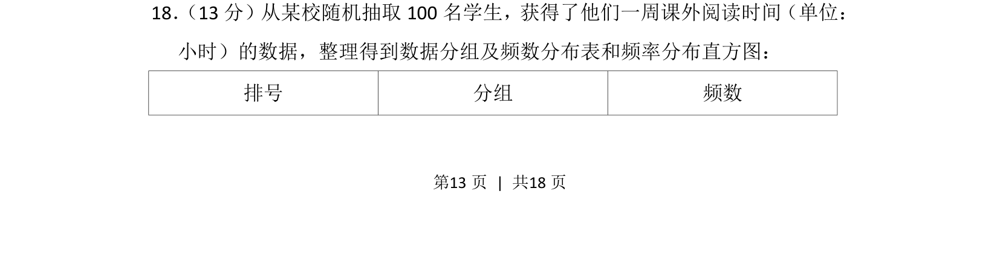
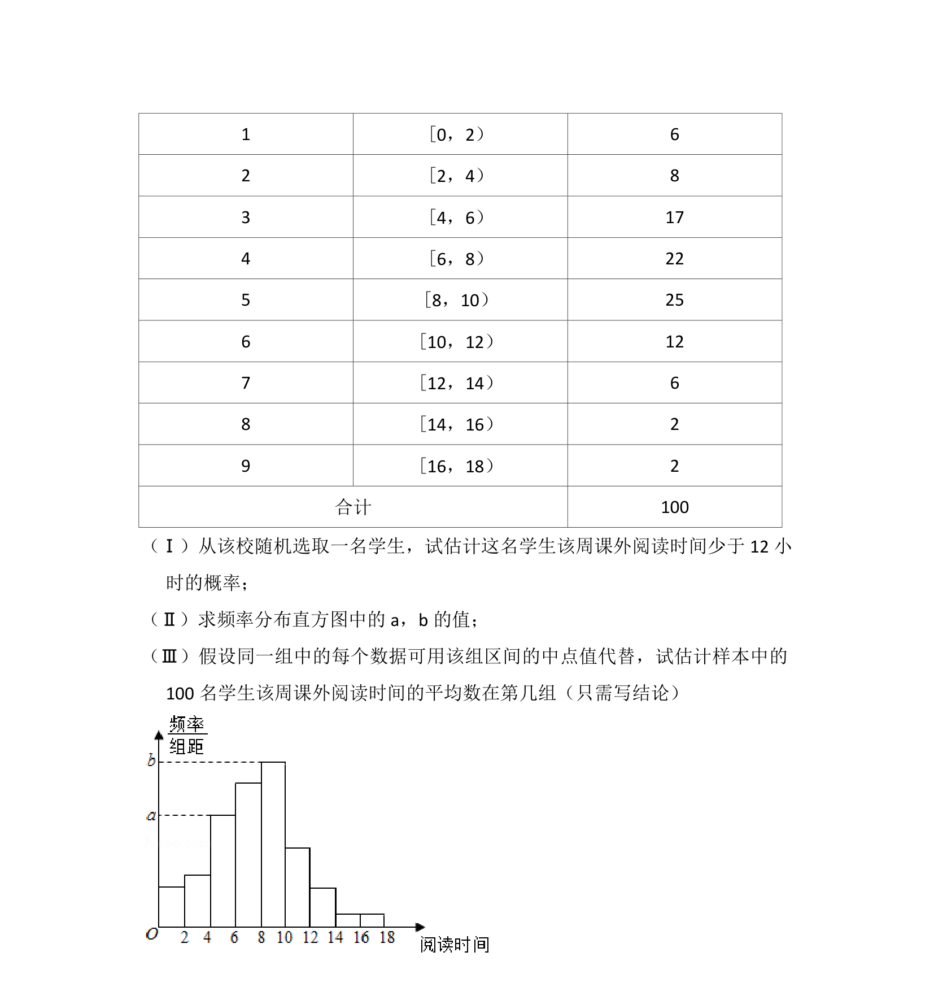
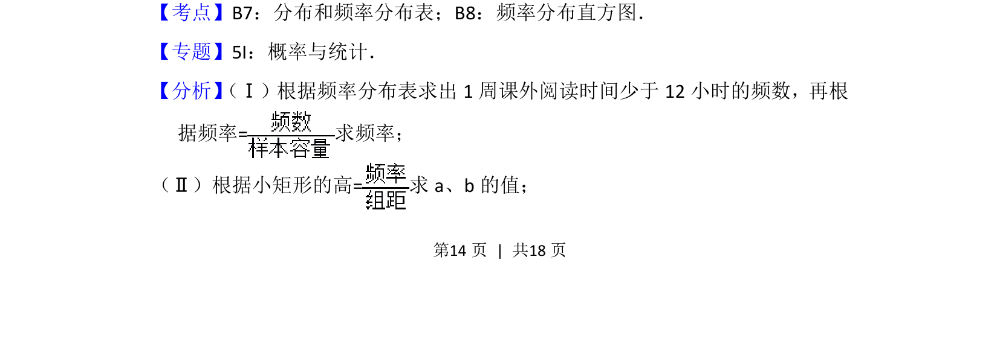
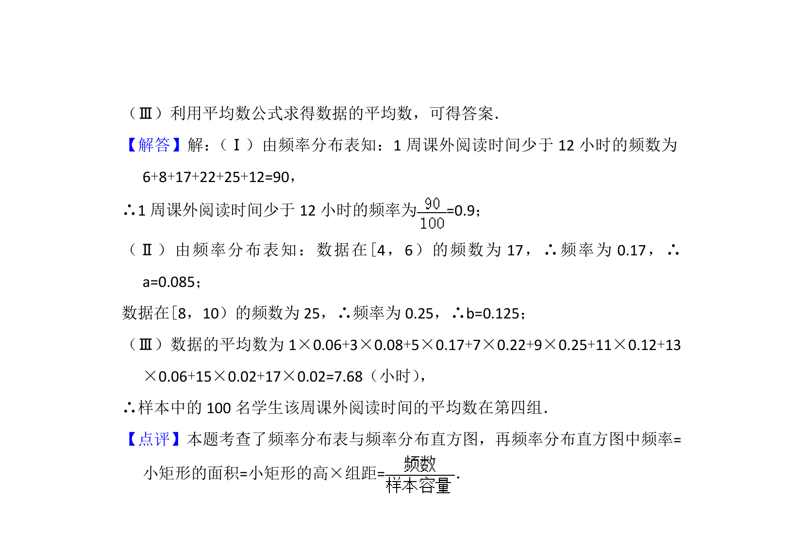

## 题面

## 摘要

统计数据的频数分布表和频率直方图的理解与应用。

## 关联考点

- [[364-频率分布直方图|频率分布直方图]]
- [[1153-频数分布表|频数分布表]]
- [[141-统计图|统计图表]]

## 答案与解析

> 📄 原 PDF 第 13 页：`素材/真题/北京/2008-2024·（北京）数学高考真题/2014年高考数学试卷（文）（北京）（解析卷）.pdf`
