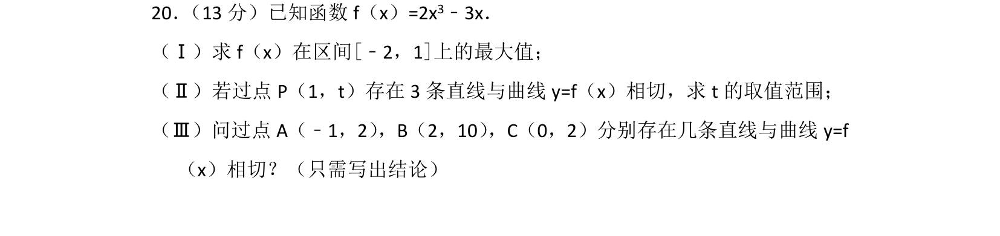
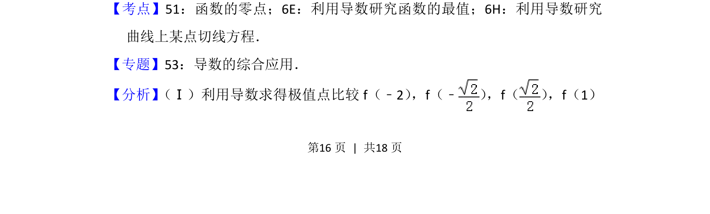
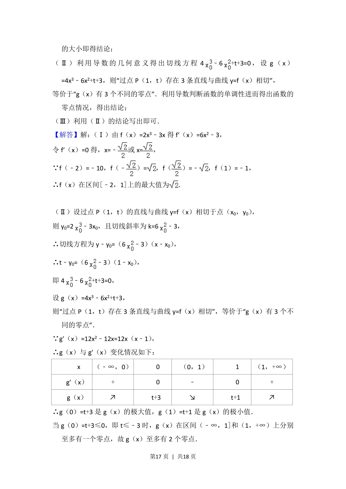
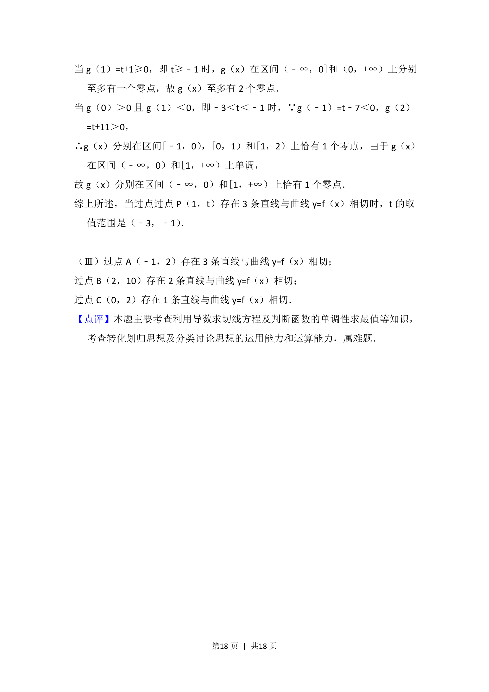

## 题面

## 摘要

本题考查导数求最值、过定点的切线存在性及切线条数判断，综合应用函数零点知识。

## 关联考点

- [[288-函数零点|函数的零点]]
- [[706-利用导数研究函数的最值|利用导数研究函数的最值]]
- [[710-利用导数研究曲线上某点切线方程|利用导数研究曲线上某点切线方程]]

## 答案与解析

> 📄 原 PDF 第 16 页：`素材/真题/北京/2008-2024·（北京）数学高考真题/2014年高考数学试卷（文）（北京）（解析卷）.pdf`
