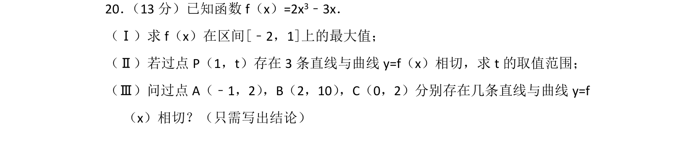
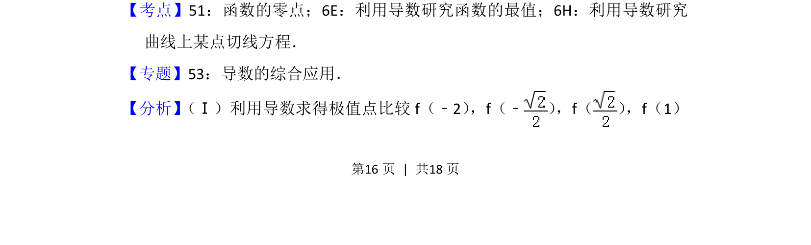
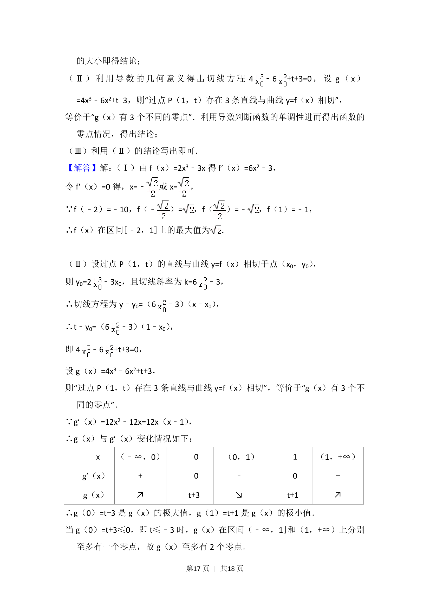
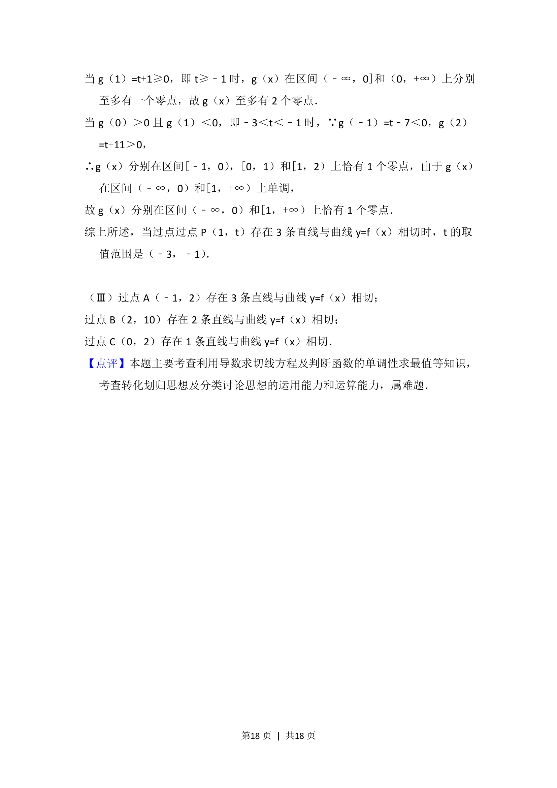

## 题面

## 摘要

本题考查导数求最值、过定点的切线存在性及切线条数判断，综合应用函数零点知识。

## 关联考点

- [[288-函数零点|函数的零点]]
- [[706-利用导数研究函数的最值|利用导数研究函数的最值]]
- [[710-利用导数研究曲线上某点切线方程|利用导数研究曲线上某点切线方程]]

## 答案与解析

> 📄 原 PDF 第 16 页：`素材/真题/北京/2008-2024·（北京）数学高考真题/2014年高考数学试卷（文）（北京）（解析卷）.pdf`

<!-- 题干文本-start -->
## 题干文本
20． （13分）已知函数f（x）=2x3﹣3x．
（Ⅰ）求f（x）在区间[﹣2，1]上的最大值；
（Ⅱ）若过点P（1，t）存在3条直线与曲线y=f（x）相切，求t的取值范围；
（Ⅲ）问过点A（﹣1，2） ，B（2，10） ，C（0，2）分别存在几条直线与曲线y=f
（x）相切？（只需写出结论）
<!-- 题干文本-end -->

<!-- 解析文本-start -->
## 解析文本
【考点】51：函数的零点；6E：利用导数研究函数的最值；6H：利用导数研究
曲线上某点切线方程．菁优网版权所有
【专题】53：导数的综合应用．
【分析】 （Ⅰ）利用导数求得极值点比较f（﹣2） ，f（﹣） ，f（ ） ，f（1）
<!-- 解析文本-end -->
