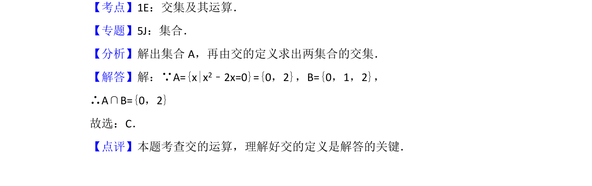

## 题面

## 摘要

本题考查一元二次方程求解及集合交集的运算。

## 关联考点

- [[042-集合|集合]]
- [[646-交集运算|交集运算]]

## 答案与解析

> 📄 原 PDF 第 1 页：`素材/真题/北京/2008-2024·（北京）数学高考真题/2014年高考数学试卷（理）（北京）（解析卷）.pdf`

<!-- 题干文本-start -->
## 题干文本
1． （5分）已知集合A={x|x2﹣2x=0}，B={0，1，2}，则A∩B=（　　）
A．{0}B．{0，1}C．{0，2}D．{0，1，2}
<!-- 题干文本-end -->

<!-- 解析文本-start -->
## 解析文本
【考点】1E：交集及其运算．菁优网版权所有
【专题】5J：集合．
【分析】解出集合A，再由交的定义求出两集合的交集．
【解答】解：∵A={x|x2﹣2x=0}={0，2}，B={0，1，2}，
∴A∩B={0，2}
故选：C．
【点评】本题考查交的运算，理解好交的定义是解答的关键．
<!-- 解析文本-end -->
