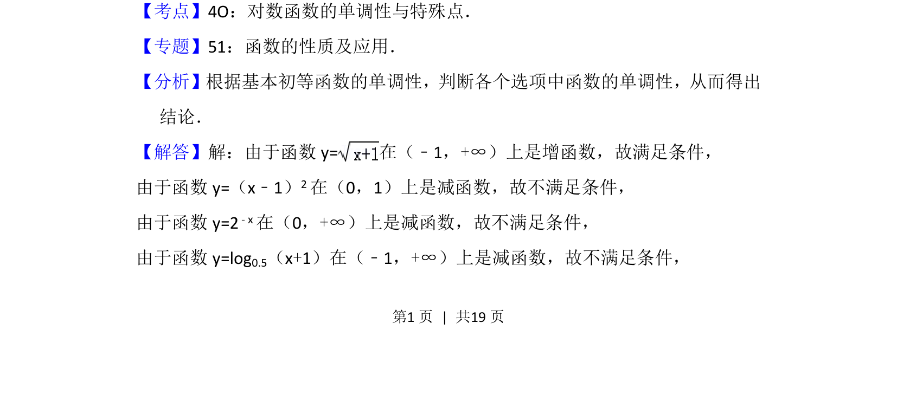
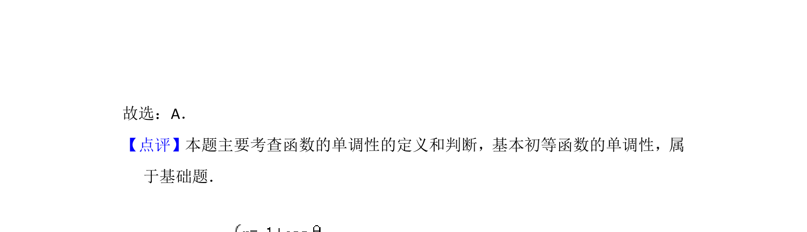

## 题面

## 摘要

考查基本初等函数在区间(0,+∞)上的单调性判断。

## 关联考点

- [[对数函数的单调性]]
- [[指数函数的单调性]]
- [[二次函数的单调性]]
- [[幂函数的单调性]]

## 答案与解析

> 📄 原 PDF 第 1 页：`素材/真题/北京/2008-2024·（北京）数学高考真题/2014年高考数学试卷（理）（北京）（解析卷）.pdf`

<!-- 题干文本-start -->
## 题干文本
2． （5分）下列函数中，在区间（0，+∞）上为增函数的是（　　）
A．y= B．y=（x﹣1） 2
C．y=2﹣x D．y=log0.5（x+1）
<!-- 题干文本-end -->

<!-- 解析文本-start -->
## 解析文本
【考点】4O：对数函数的单调性与特殊点．菁优网版权所有
【专题】51：函数的性质及应用．
【分析】根据基本初等函数的单调性，判断各个选项中函数的单调性，从而得出
结论．
【解答】解：由于函数y=在（﹣1，+∞）上是增函数，故满足条件，
由于函数y=（x﹣1） 2在（0，1）上是减函数，故不满足条件，
由于函数y=2 ﹣x在（0，+∞）上是减函数，故不满足条件，
由于函数y=log 0.5（x+1）在（﹣1，+∞）上是减函数，故不满足条件，
<!-- 解析文本-end -->
