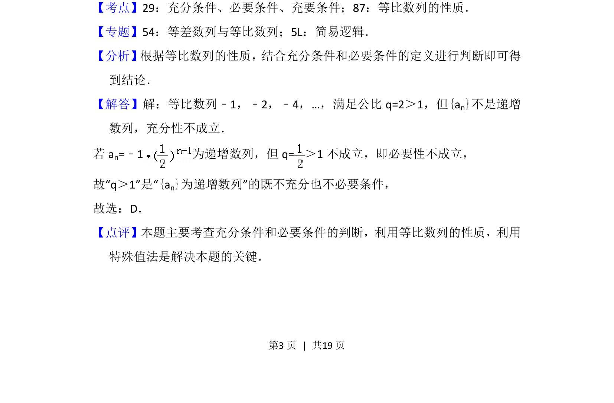

## 题面

## 摘要

考查等比数列公比与单调性的关系，利用特殊值判断充分必要条件。

## 关联考点

- [[533-充分必要条件|充分必要条件]]
- [[1068-等比数列的性质|等比数列的性质]]
- [[1116-赋值|特殊值法]]

## 答案与解析

> 📄 原 PDF 第 3 页：`素材/真题/北京/2008-2024·（北京）数学高考真题/2014年高考数学试卷（理）（北京）（解析卷）.pdf`
