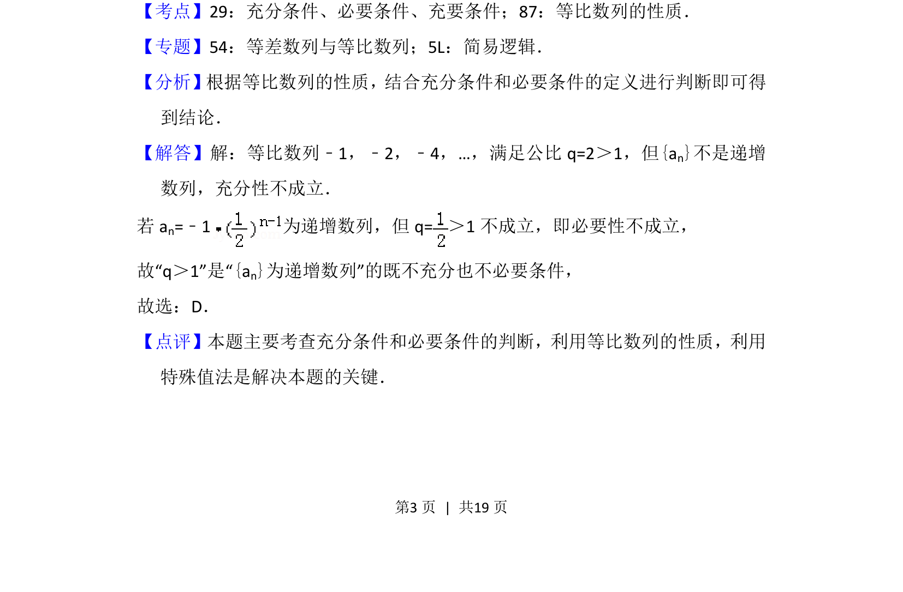

## 题面

## 摘要

考查等比数列公比与单调性的关系，利用特殊值判断充分必要条件。

## 关联考点

- [[533-充分必要条件|充分必要条件]]
- [[413-等比数列性质|等比数列的性质]]
- [[1116-赋值|特殊值法]]

## 答案与解析

> 📄 原 PDF 第 3 页：`素材/真题/北京/2008-2024·（北京）数学高考真题/2014年高考数学试卷（理）（北京）（解析卷）.pdf`

<!-- 题干文本-start -->
## 题干文本
5． （5分） 设{an}是公比为q的等比数列， 则“q＞1”是“{an}为递增数列”的 （　　）
A．充分而不必要条件B．必要而不充分条件
C．充分必要条件D．既不充分也不必要条件
<!-- 题干文本-end -->

<!-- 解析文本-start -->
## 解析文本
【考点】29：充分条件、必要条件、充要条件；87：等比数列的性质．菁优网版权所有
【专题】54：等差数列与等比数列；5L：简易逻辑．
【分析】根据等比数列的性质，结合充分条件和必要条件的定义进行判断即可得
到结论．
【解答】解：等比数列﹣1，﹣2，﹣4，…，满足公比q=2＞1，但{a n}不是递增
数列，充分性不成立．
若a n=﹣1为递增数列，但q=＞1不成立，即必要性不成立，
故“q＞1”是“{an}为递增数列”的既不充分也不必要条件，
故选：D．
【点评】本题主要考查充分条件和必要条件的判断，利用等比数列的性质，利用
特殊值法是解决本题的关键．
<!-- 解析文本-end -->
