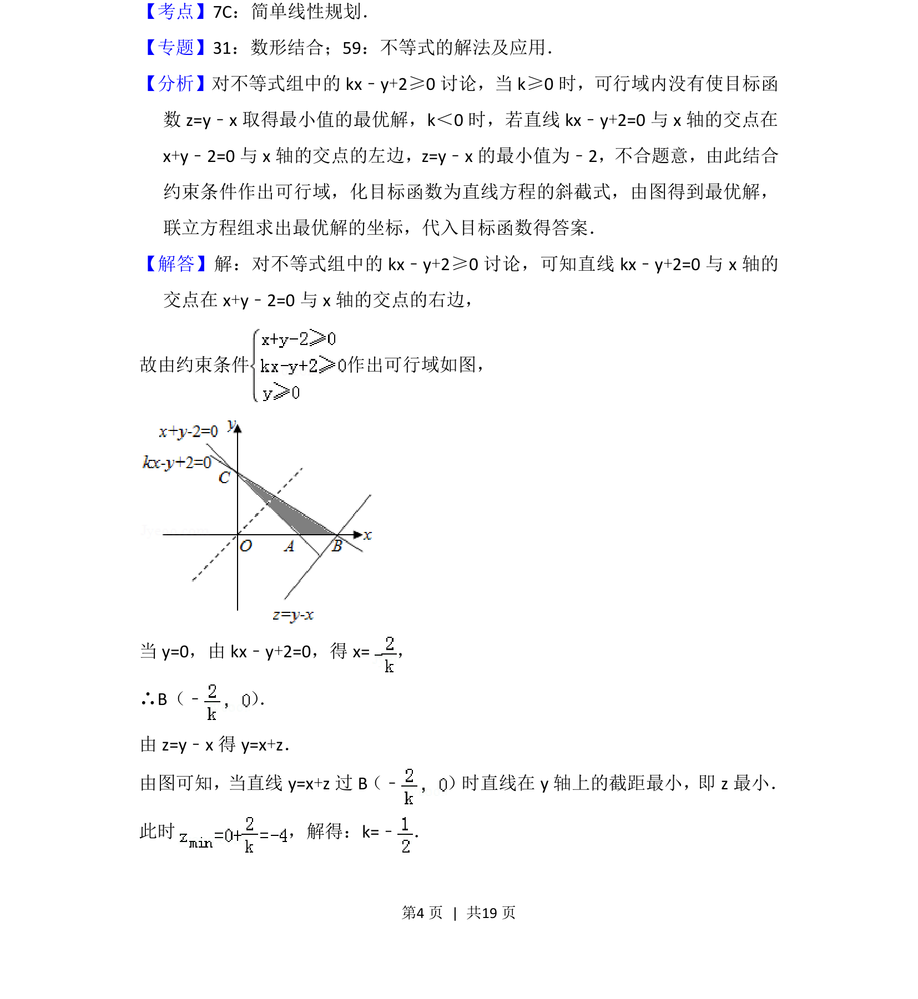

## 题面

## 摘要

考查线性规划中参数值求解，结合可行域与最优解分析。

## 关联考点

- [[1075-简单线性规划|简单线性规划]]
- [[899-数形结合思想|数形结合思想]]
- [[115-一元一次不等式组|不等式组]]

## 答案与解析

> 📄 原 PDF 第 4 页：`素材/真题/北京/2008-2024·（北京）数学高考真题/2014年高考数学试卷（理）（北京）（解析卷）.pdf`
