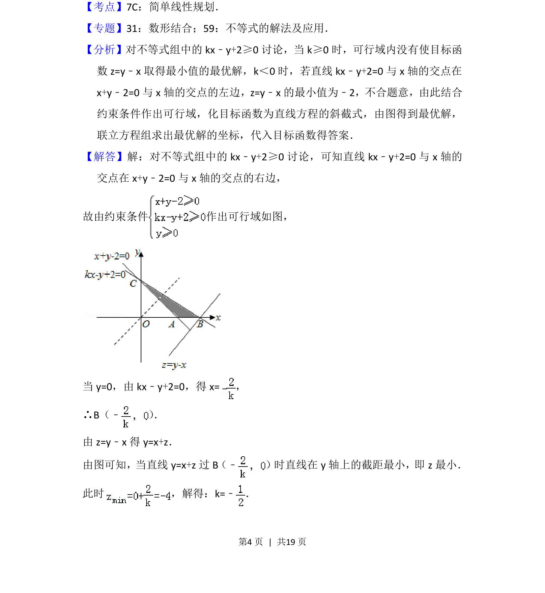
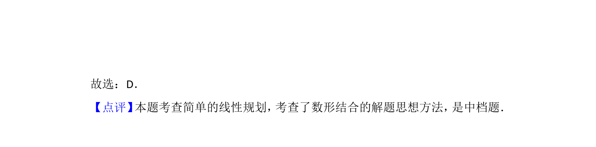

## 题面

## 摘要

考查线性规划中参数值求解，结合可行域与最优解分析。

## 关联考点

- [[1074-简单线性规划|简单线性规划]]
- [[898-数形结合思想|数形结合思想]]
- [[115-一元一次不等式组|不等式组]]

## 答案与解析

> 📄 原 PDF 第 4 页：`素材/真题/北京/2008-2024·（北京）数学高考真题/2014年高考数学试卷（理）（北京）（解析卷）.pdf`

<!-- 题干文本-start -->
## 题干文本
6． （5分） 若x，y满足 ， 且z=y﹣x的最小值为﹣4， 则k的值为 （　　）
A．2 B．﹣2 C．D．﹣
<!-- 题干文本-end -->

<!-- 解析文本-start -->
## 解析文本
【考点】7C：简单线性规划．菁优网版权所有
【专题】31：数形结合；59：不等式的解法及应用．
【分析】对不等式组中的kx﹣y+2≥0讨论，当k≥0时，可行域内没有使目标函
数z=y﹣x取得最小值的最优解，k＜0时，若直线kx﹣y+2=0与x轴的交点在
x+y﹣2=0与x轴的交点的左边，z=y﹣x的最小值为﹣2，不合题意，由此结合
约束条件作出可行域，化目标函数为直线方程的斜截式，由图得到最优解，
联立方程组求出最优解的坐标，代入目标函数得答案．
【解答】解：对不等式组中的kx﹣y+2≥0讨论，可知直线kx﹣y+2=0与x轴的
交点在x+y﹣2=0与x轴的交点的右边，
故由约束条件 作出可行域如图，
当y=0，由kx﹣y+2=0，得x=，
∴B（﹣） ．
由z=y﹣x得y=x+z．
由图可知，当直线y=x+z过B（﹣）时直线在y轴上的截距最小，即z最小．
此时 ，解得：k=﹣．
<!-- 解析文本-end -->
