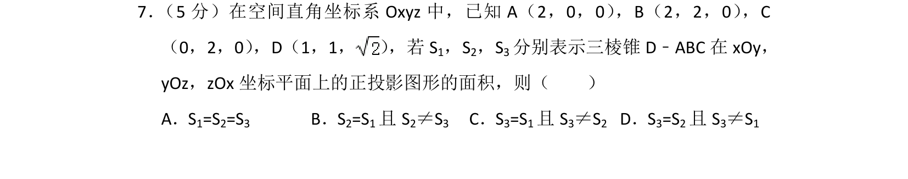
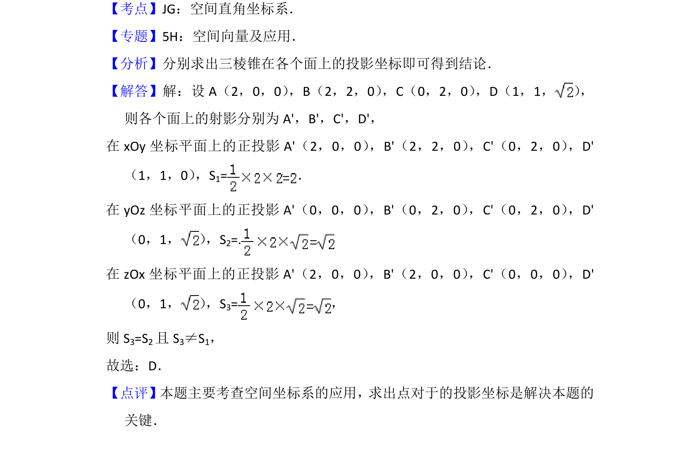

## 题面

## 摘要

空间直角坐标系中三棱锥在坐标平面上的正投影面积计算。

## 关联考点

- [[399-空间向量坐标表示|空间直角坐标系]]
- [[251-正投影|正投影]]
- [[1147-面积计算|面积计算]]

## 答案与解析

> 📄 原 PDF 第 5 页：`素材/真题/北京/2008-2024·（北京）数学高考真题/2014年高考数学试卷（理）（北京）（解析卷）.pdf`
