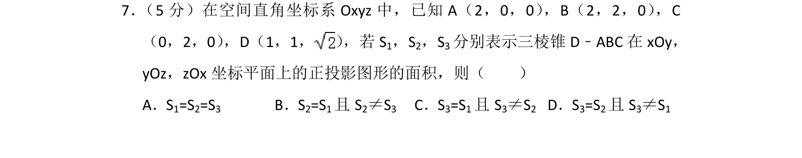
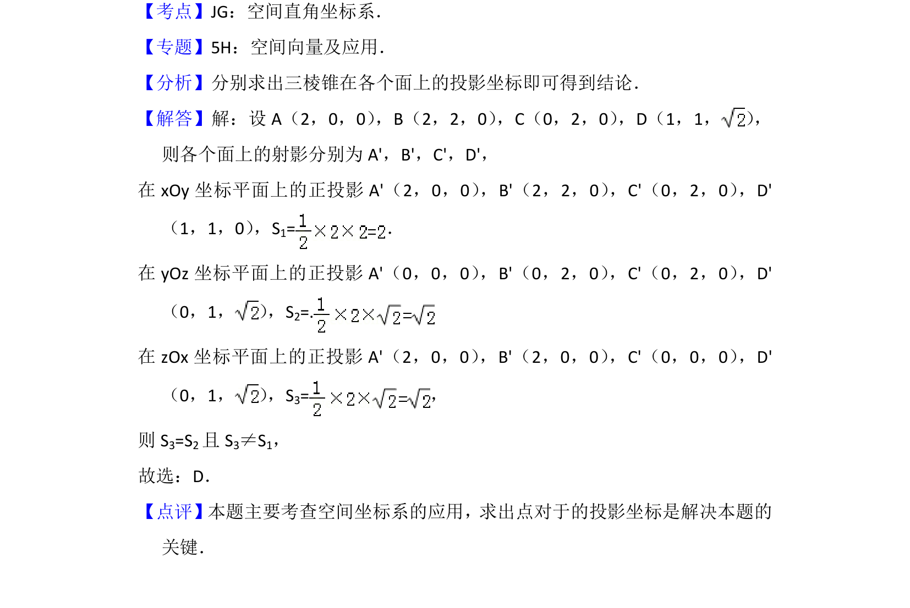

## 题面

## 摘要

空间直角坐标系中三棱锥在坐标平面上的正投影面积计算。

## 关联考点

- [[399-空间向量坐标表示|空间直角坐标系]]
- [[251-正投影|正投影]]
- [[1146-面积计算|面积计算]]

## 答案与解析

> 📄 原 PDF 第 5 页：`素材/真题/北京/2008-2024·（北京）数学高考真题/2014年高考数学试卷（理）（北京）（解析卷）.pdf`

<!-- 题干文本-start -->
## 题干文本
7． （5分）在空间直角坐标系Oxyz中，已知A（2，0，0） ，B（2，2，0） ，C
（0，2，0） ，D（1，1， ） ，若S1，S2，S3分别表示三棱锥D﹣ABC在xOy，
yOz，zOx坐标平面上的正投影图形的面积，则（　　）
A．S1=S2=S3 B．S2=S1且S 2≠S3 C．S3=S1且S 3≠S2 D．S3=S2且S 3≠S1
<!-- 题干文本-end -->

<!-- 解析文本-start -->
## 解析文本
【考点】JG：空间直角坐标系．菁优网版权所有
【专题】5H：空间向量及应用．
【分析】分别求出三棱锥在各个面上的投影坐标即可得到结论．
【解答】解：设A（2，0，0） ，B（2，2，0） ，C（0，2，0） ，D（1，1， ） ，
则各个面上的射影分别为A'，B'，C'，D'，
在xOy坐标平面上的正投影A'（2，0，0） ，B'（2，2，0） ，C'（0，2，0） ，D'
（1，1，0） ，S1=．
在yOz坐标平面上的正投影A'（0，0，0） ，B'（0，2，0） ，C'（0，2，0） ，D'
（0，1， ） ，S2=.
在zOx坐标平面上的正投影A'（2，0，0） ，B'（2，0，0） ，C'（0，0，0） ，D'
（0，1， ） ，S3=，
则S 3=S2且S 3≠S1，
故选：D．
【点评】本题主要考查空间坐标系的应用，求出点对于的投影坐标是解决本题的
关键．
<!-- 解析文本-end -->
