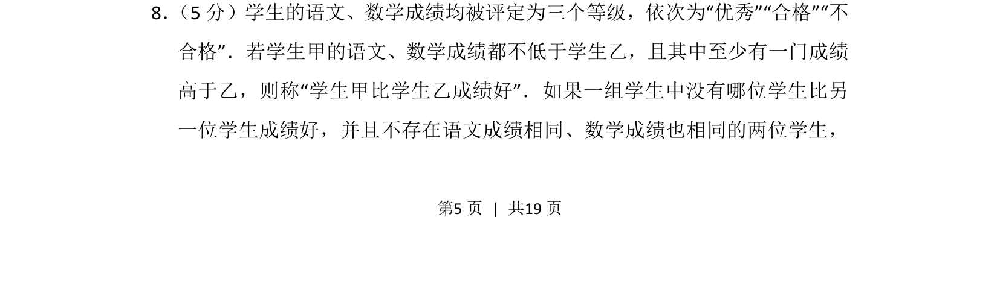
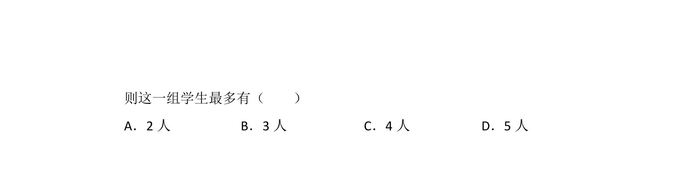
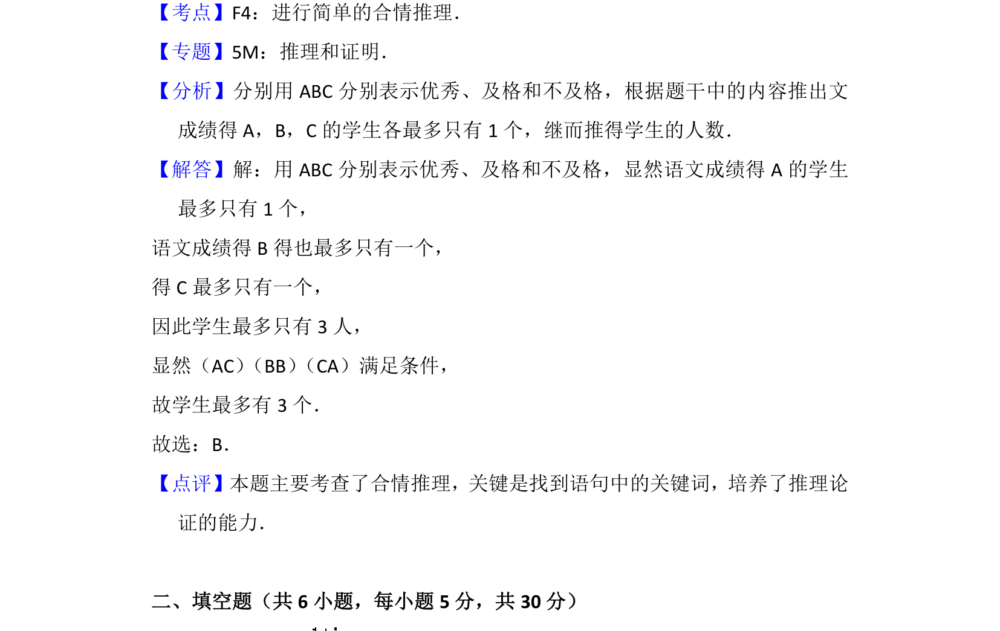

## 题面

## 摘要

基于成绩等级的比较关系定义，求满足无优劣关系且成绩不完全相同条件下学生组最多人数。

## 关联考点

- [[集合的关系与序]]
- [[1090-组合计数|组合计数]]
- [[037-推理|逻辑推理]]

## 答案与解析

> 📄 原 PDF 第 5 页：`素材/真题/北京/2008-2024·（北京）数学高考真题/2014年高考数学试卷（理）（北京）（解析卷）.pdf`
