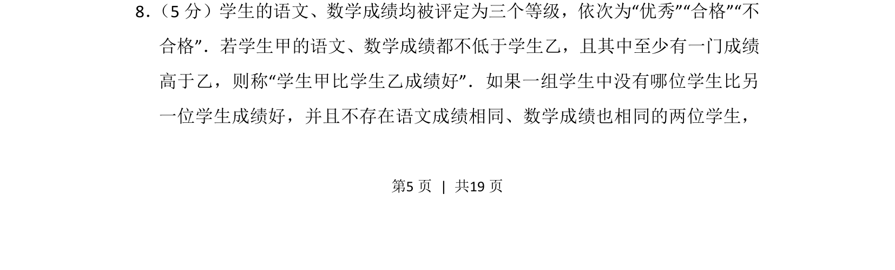
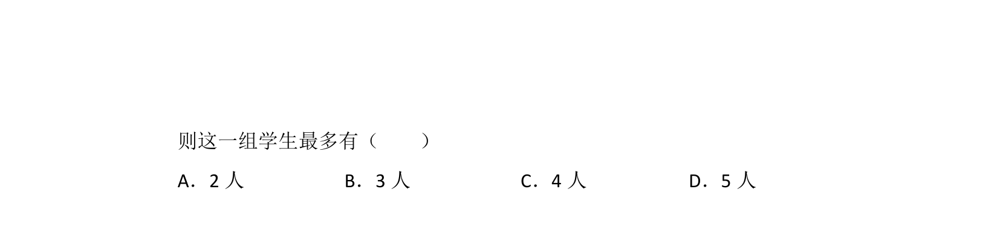
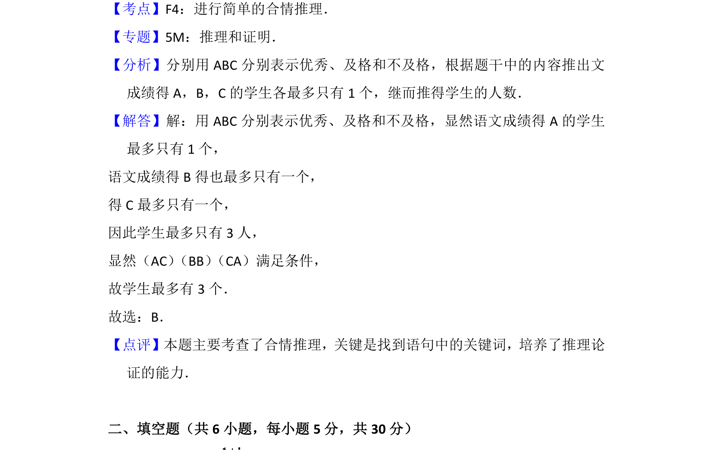

## 题面

## 摘要

基于成绩等级的比较关系定义，求满足无优劣关系且成绩不完全相同条件下学生组最多人数。

## 关联考点

- [[集合的关系与序]]
- [[1090-组合计数|组合计数]]
- [[037-推理|逻辑推理]]

## 答案与解析

> 📄 原 PDF 第 5 页：`素材/真题/北京/2008-2024·（北京）数学高考真题/2014年高考数学试卷（理）（北京）（解析卷）.pdf`

<!-- 题干文本-start -->
## 题干文本
8． （5分）学生的语文、数学成绩均被评定为三个等级，依次为“优秀”“合格”“不
合格”．若学生甲的语文、数学成绩都不低于学生乙，且其中至少有一门成绩
高于乙，则称“学生甲比学生乙成绩好”．如果一组学生中没有哪位学生比另
一位学生成绩好，并且不存在语文成绩相同、数学成绩也相同的两位学生，
<!-- 题干文本-end -->

<!-- 解析文本-start -->
## 解析文本

<!-- 解析文本-end -->
