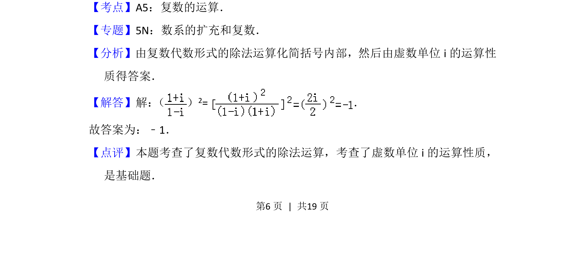

## 题面

## 摘要

本题主要考查复数代数形式的除法运算及虚数单位 i 的运算性质。

## 关联考点

- [[805-复数的四则运算|复数的四则运算]]
- [[虚数单位i的性质]]

## 答案与解析

> 📄 原 PDF 第 6 页：`素材/真题/北京/2008-2024·（北京）数学高考真题/2014年高考数学试卷（理）（北京）（解析卷）.pdf`

<!-- 题干文本-start -->
## 题干文本
9． （5分）复数（ ） 2=　﹣1　．
<!-- 题干文本-end -->

<!-- 解析文本-start -->
## 解析文本
【考点】A5：复数的运算．菁优网版权所有
【专题】5N：数系的扩充和复数．
【分析】由复数代数形式的除法运算化简括号内部，然后由虚数单位i的运算性
质得答案．
【解答】解： （ ） 2=．
故答案为：﹣1．
【点评】本题考查了复数代数形式的除法运算，考查了虚数单位i的运算性质，
是基础题．
<!-- 解析文本-end -->
