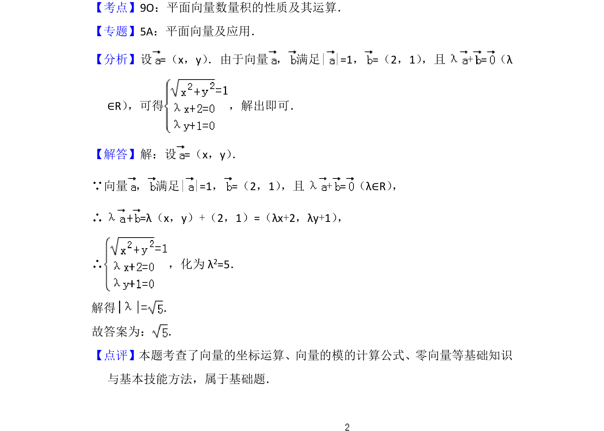

## 题面

## 摘要

已知向量的模与坐标，通过向量相等建立方程，求解参数 λ 的绝对值。

## 关联考点

- [[1358-向量的坐标运算|向量的坐标运算]]
- [[752-向量模长|向量的模]]
- [[向量方程]]

## 答案与解析

> 📄 原 PDF 第 7 页：`素材/真题/北京/2008-2024·（北京）数学高考真题/2014年高考数学试卷（理）（北京）（解析卷）.pdf`
