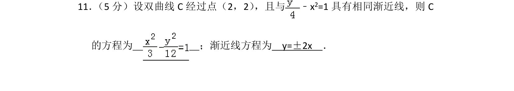
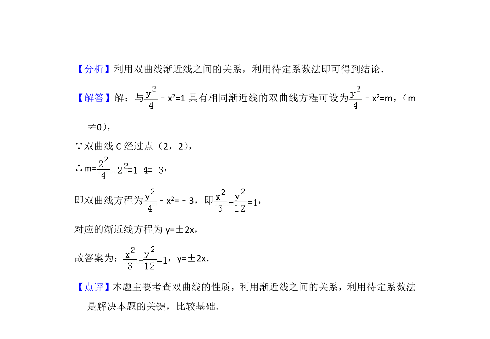

## 题面

## 摘要

题目要求根据双曲线过定点和已知渐近线求双曲线方程，并写出渐近线方程。

## 关联考点

- [[731-双曲线的性质|双曲线的性质]]
- [[369-双曲线渐近线|渐近线]]
- [[1080-系数求解|待定系数法]]

## 答案与解析

> 📄 原 PDF 第 7 页：`素材/真题/北京/2008-2024·（北京）数学高考真题/2014年高考数学试卷（理）（北京）（解析卷）.pdf`
