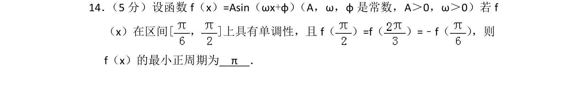
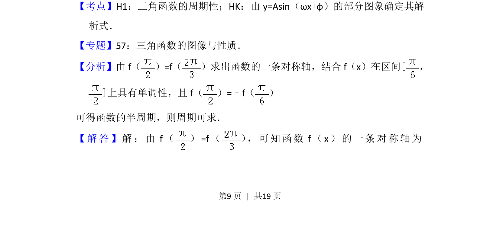
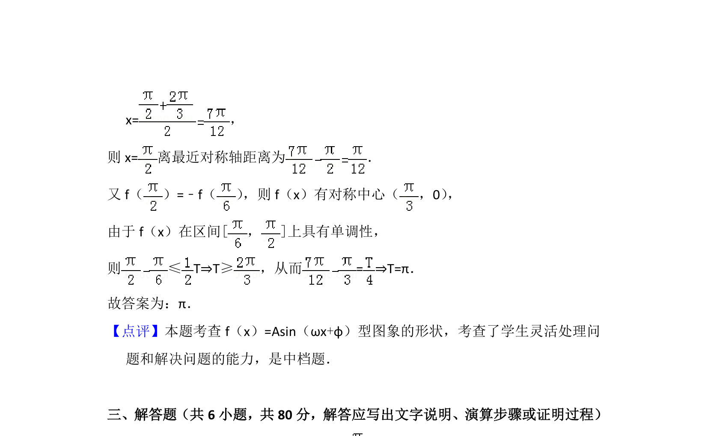

## 题面

## 摘要

已知单调区间及函数值对称关系，求三角函数最小正周期

## 关联考点

- [[611-三角函数的周期性|三角函数的周期性]]
- [[567-正弦函数的对称性|正弦函数的对称性]]
- [[961-正弦函数的单调性|正弦函数的单调性]]

## 答案与解析

> 📄 原 PDF 第 9 页：`素材/真题/北京/2008-2024·（北京）数学高考真题/2014年高考数学试卷（理）（北京）（解析卷）.pdf`
