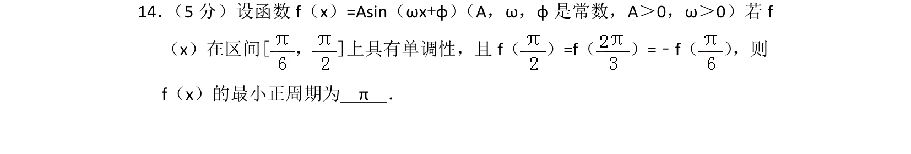
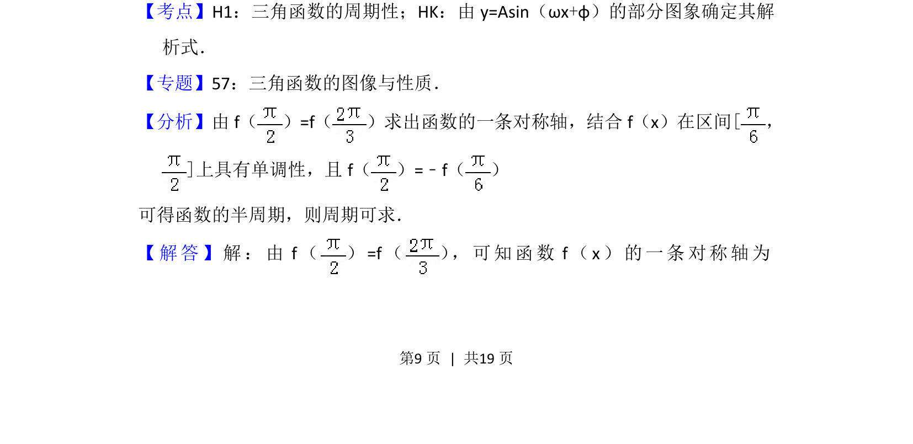
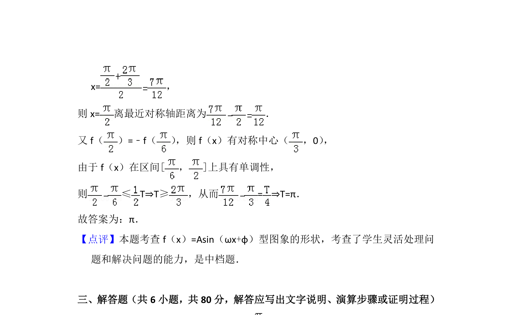

## 题面

## 摘要

已知单调区间及函数值对称关系，求三角函数最小正周期

## 关联考点

- [[611-三角函数的周期性|三角函数的周期性]]
- [[567-正弦函数的对称性|正弦函数的对称性]]
- [[961-正弦函数的单调性|正弦函数的单调性]]

## 答案与解析

> 📄 原 PDF 第 9 页：`素材/真题/北京/2008-2024·（北京）数学高考真题/2014年高考数学试卷（理）（北京）（解析卷）.pdf`

<!-- 题干文本-start -->
## 题干文本
14． （5分）设函数f（x）=Asin（ωx+φ） （A，ω，φ是常数，A＞0，ω＞0）若f
（x）在区间[，]上具有单调性，且f（ ）=f（ ）=﹣f（ ） ，则
f（x）的最小正周期为　π　．
<!-- 题干文本-end -->

<!-- 解析文本-start -->
## 解析文本
【考点】H1：三角函数的周期性；HK：由y=Asin（ωx+φ）的部分图象确定其解
析式．菁优网版权所有
【专题】57：三角函数的图像与性质．
【分析】由f（ ）=f（ ）求出函数的一条对称轴，结合f（x）在区间[，
]上具有单调性，且f（ ）=﹣f（ ）
可得函数的半周期，则周期可求．
【解答】解：由f（ ）=f（ ） ，可知函数f（x）的一条对称轴为
<!-- 解析文本-end -->
