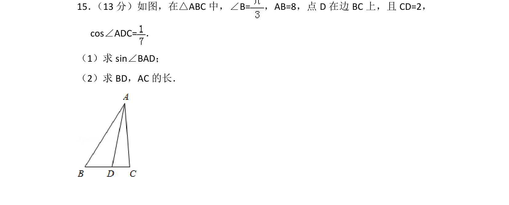
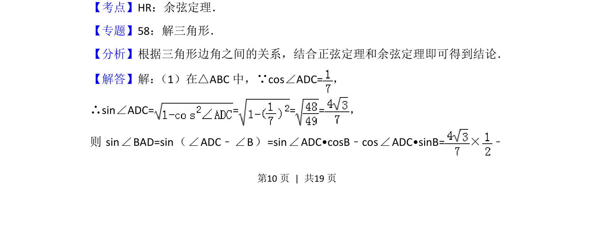
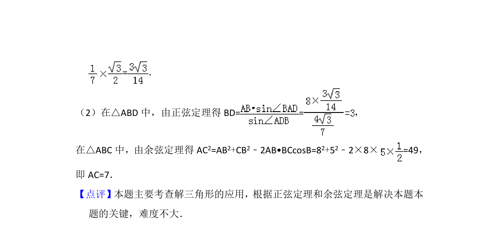

## 题面

## 摘要

在三角形中已知边角关系，运用正弦定理和余弦定理及三角恒等变换求边长和角的正弦值。

## 关联考点

- [[126-定理|正弦定理]]
- [[126-定理|余弦定理]]
- [[1395-两角差的正弦公式|两角差的正弦公式]]

## 答案与解析

> 📄 原 PDF 第 10 页：`素材/真题/北京/2008-2024·（北京）数学高考真题/2014年高考数学试卷（理）（北京）（解析卷）.pdf`
