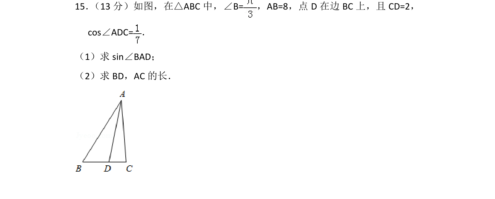
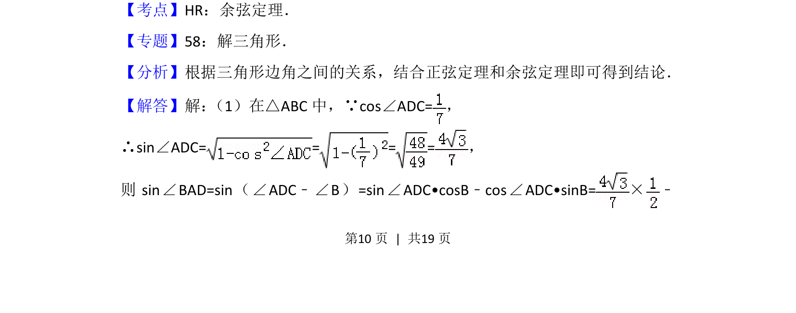
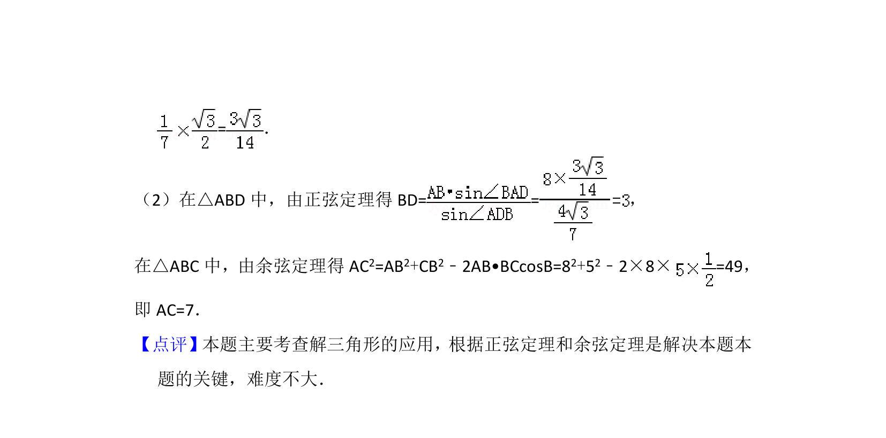

## 题面

## 摘要

在三角形中已知边角关系，运用正弦定理和余弦定理及三角恒等变换求边长和角的正弦值。

## 关联考点

- [[126-定理|正弦定理]]
- [[126-定理|余弦定理]]
- [[1395-两角差的正弦公式|两角差的正弦公式]]

## 答案与解析

> 📄 原 PDF 第 10 页：`素材/真题/北京/2008-2024·（北京）数学高考真题/2014年高考数学试卷（理）（北京）（解析卷）.pdf`

<!-- 题干文本-start -->
## 题干文本
15． （13分）如图，在△ABC中，∠B=，AB=8，点D在边BC上，且CD=2，
cos∠ADC=．
（1）求sin∠BAD；
（2）求BD，AC的长．
<!-- 题干文本-end -->

<!-- 解析文本-start -->
## 解析文本
【考点】HR：余弦定理．菁优网版权所有
【专题】58：解三角形．
【分析】根据三角形边角之间的关系，结合正弦定理和余弦定理即可得到结论．
【解答】解： （1）在△ABC中，∵cos∠ADC=，
∴sin∠ADC= = = =，
则sin∠BAD=sin（∠ADC﹣∠B）=sin∠ADC•cosB﹣cos∠ADC•sinB=×﹣
<!-- 解析文本-end -->
