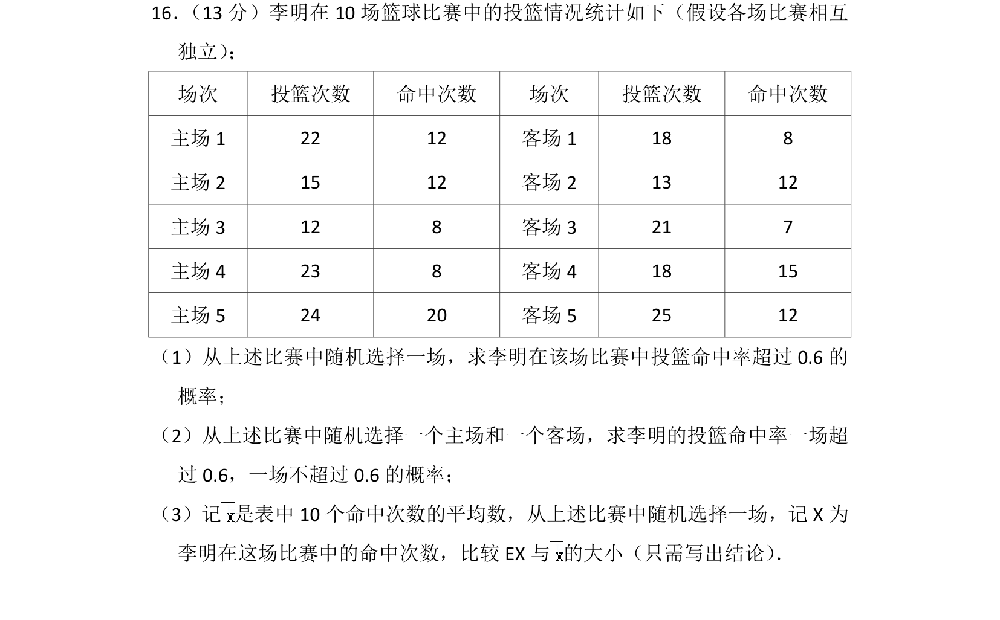
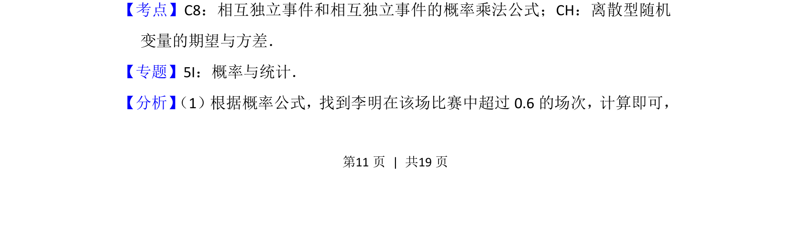
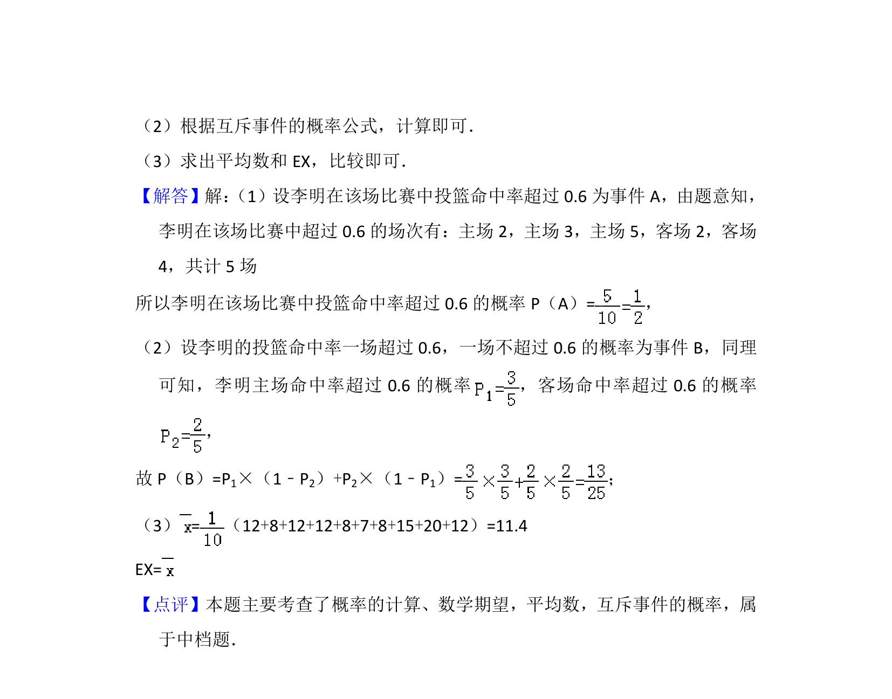

## 题面

## 摘要

结合篮球比赛投篮数据，计算随机事件的概率、相互独立事件同时发生的概率，并比较期望与平均数。

## 关联考点

- [[320-古典概型|古典概型]]
- [[相互独立事件概率乘法公式]]
- [[1331-离散型随机变量的期望与方差|离散型随机变量的期望与方差]]

## 答案与解析

> 📄 原 PDF 第 11 页：`素材/真题/北京/2008-2024·（北京）数学高考真题/2014年高考数学试卷（理）（北京）（解析卷）.pdf`
