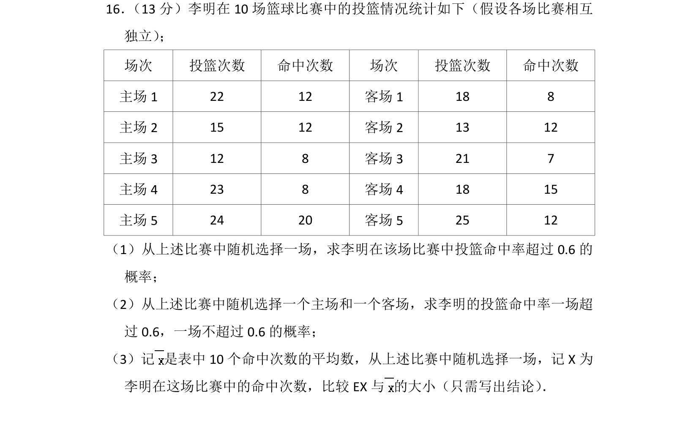
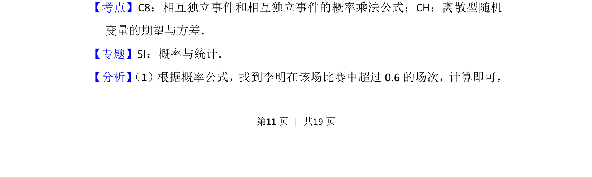
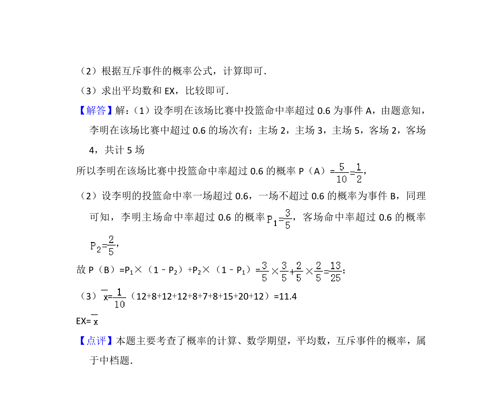

## 题面

## 摘要

结合篮球比赛投篮数据，计算随机事件的概率、相互独立事件同时发生的概率，并比较期望与平均数。

## 关联考点

- [[320-古典概型|古典概型]]
- [[相互独立事件概率乘法公式]]
- [[1331-离散型随机变量的期望与方差|离散型随机变量的期望与方差]]

## 答案与解析

> 📄 原 PDF 第 11 页：`素材/真题/北京/2008-2024·（北京）数学高考真题/2014年高考数学试卷（理）（北京）（解析卷）.pdf`

<!-- 题干文本-start -->
## 题干文本
16． （13分）李明在10场篮球比赛中的投篮情况统计如下（假设各场比赛相互
独立） ；
场次 投篮次数 命中次数 场次 投篮次数 命中次数
主场1 22 12 客场1 18 8
主场2 15 12 客场2 13 12
主场3 12 8 客场3 21 7
主场4 23 8 客场4 18 15
主场5 24 20 客场5 25 12
（1）从上述比赛中随机选择一场，求李明在该场比赛中投篮命中率超过0.6的
概率；
（2）从上述比赛中随机选择一个主场和一个客场，求李明的投篮命中率一场超
过0.6，一场不超过0.6的概率；
（3）记 是表中10个命中次数的平均数，从上述比赛中随机选择一场，记X为
李明在这场比赛中的命中次数，比较EX与 的大小（只需写出结论） ．
<!-- 题干文本-end -->

<!-- 解析文本-start -->
## 解析文本
【考点】C8：相互独立事件和相互独立事件的概率乘法公式；CH：离散型随机
变量的期望与方差．菁优网版权所有
【专题】5I：概率与统计．
【分析】 （1）根据概率公式，找到李明在该场比赛中超过0.6的场次，计算即可，
<!-- 解析文本-end -->
