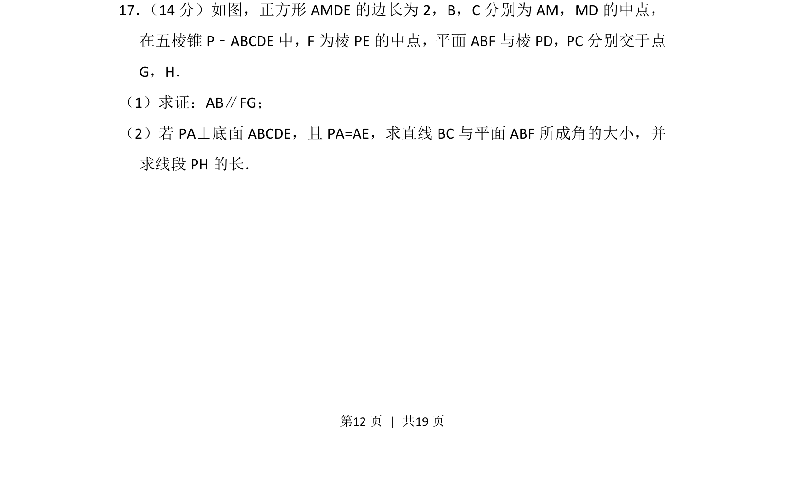
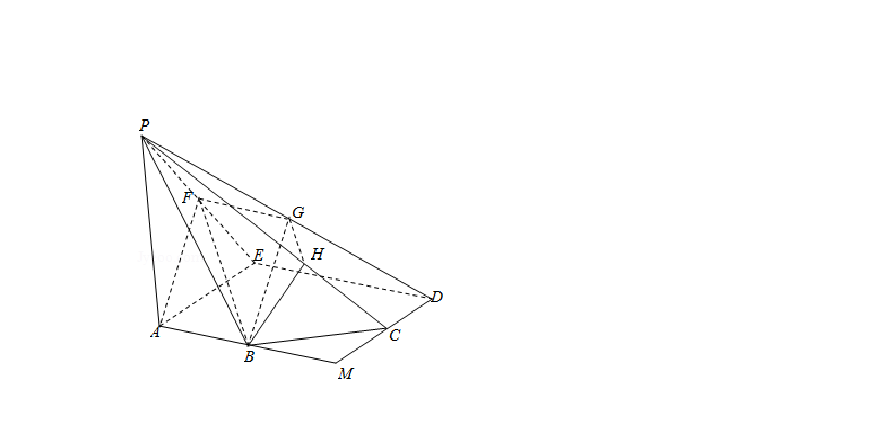
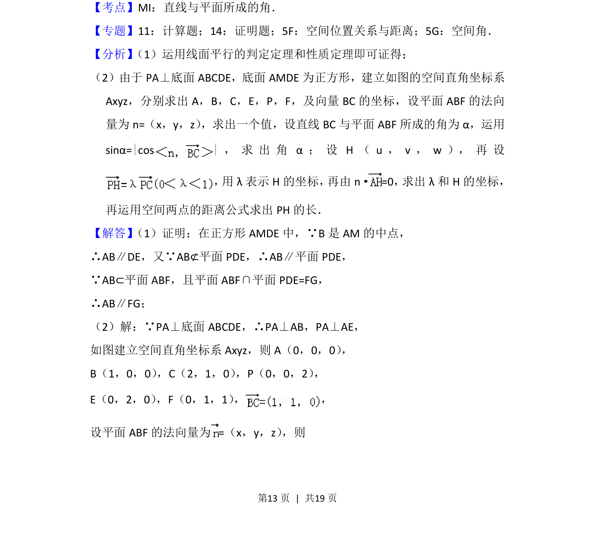
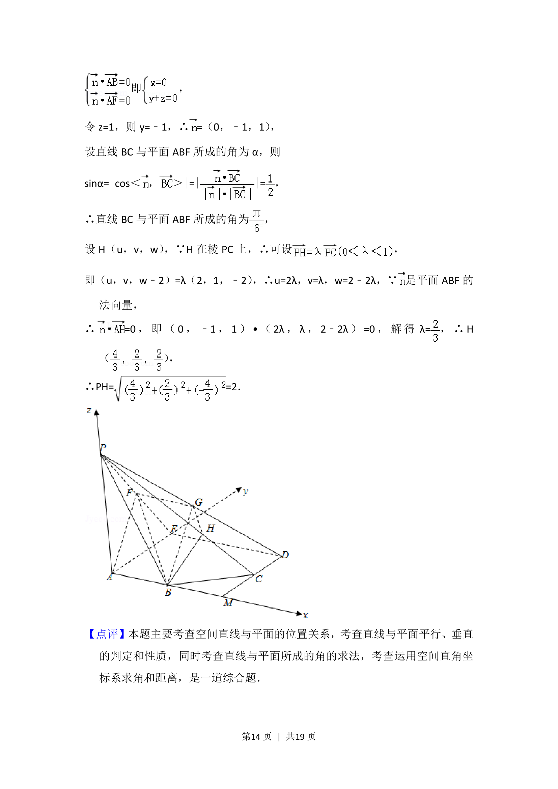

## 题面

## 摘要

线面平行判定与性质、空间角的向量计算及空间几何量求解

## 关联考点

- [[352-空间直线平面平行|线面平行]]
- [[353-空间角|线面角]]
- [[753-向量法|向量法]]
- [[354-空间距离|空间距离]]

## 答案与解析

> 📄 原 PDF 第 12 页：`素材/真题/北京/2008-2024·（北京）数学高考真题/2014年高考数学试卷（理）（北京）（解析卷）.pdf`
