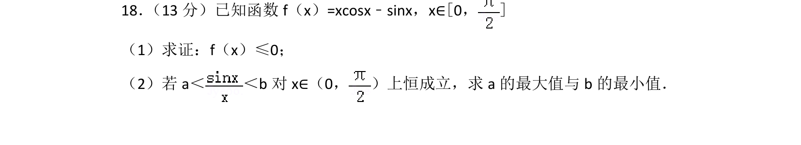
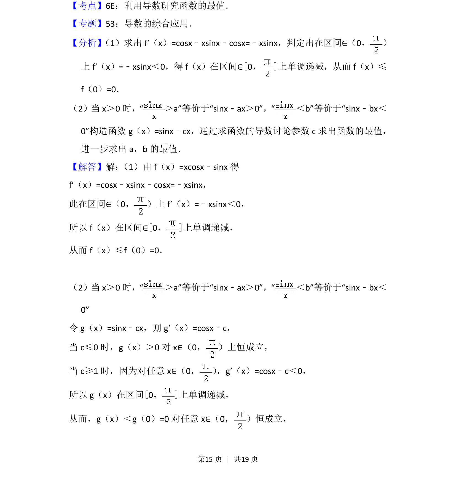
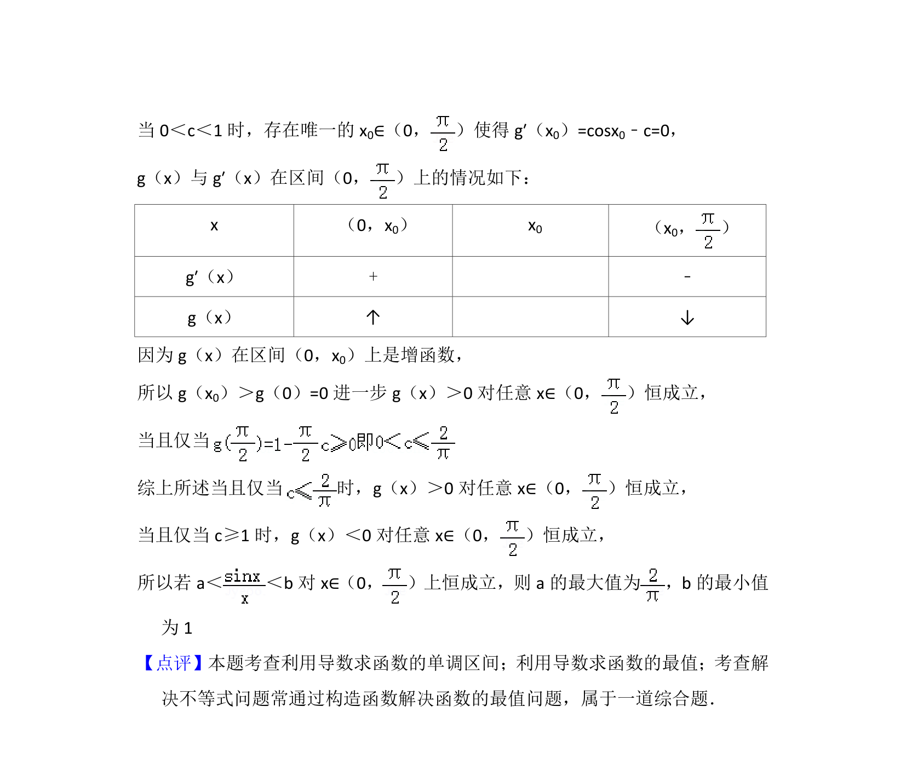

## 题面

## 摘要

利用导数研究函数单调性、证明不等式并求解恒成立问题中的参数最值。

## 关联考点

- [[导数研究函数单调性]]
- [[706-利用导数研究函数的最值|利用导数研究函数的最值]]
- [[450-恒成立问题|恒成立问题]]
- [[724-参数最值|参数最值]]

## 答案与解析

> 📄 原 PDF 第 15 页：`素材/真题/北京/2008-2024·（北京）数学高考真题/2014年高考数学试卷（理）（北京）（解析卷）.pdf`
