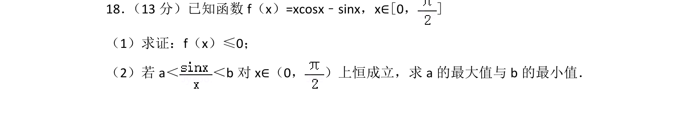
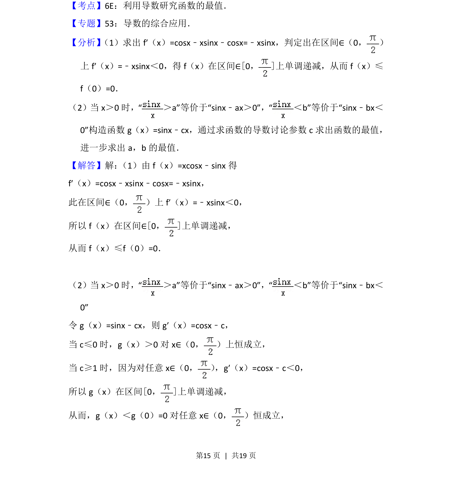
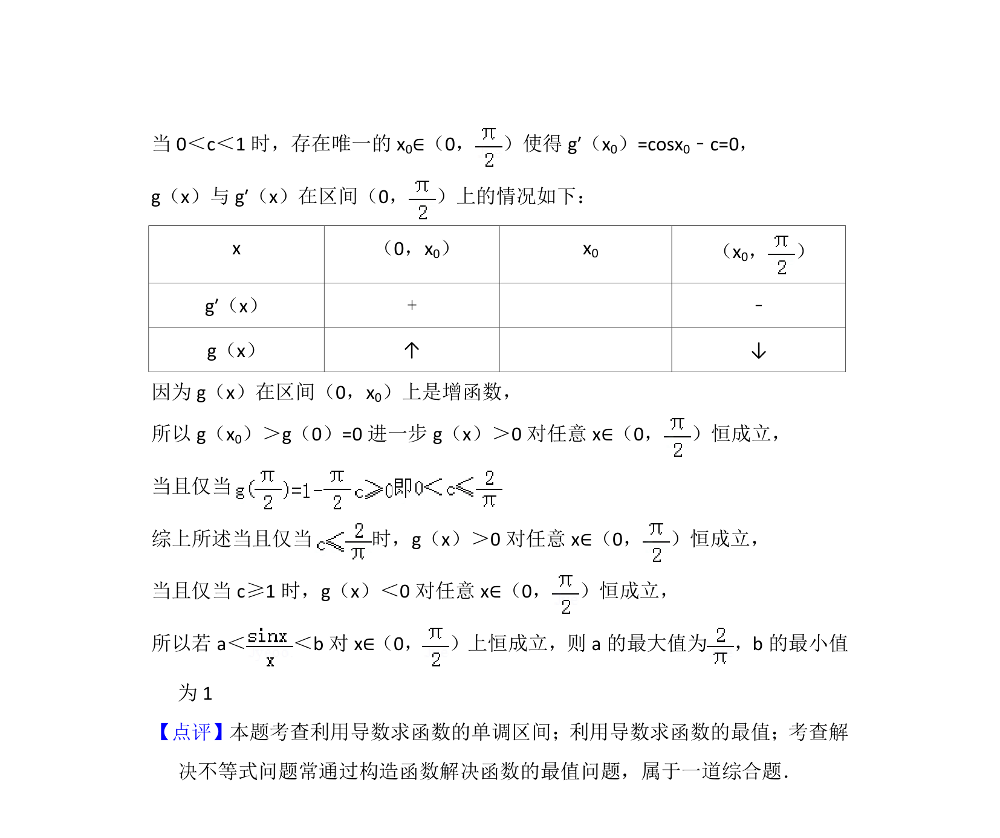

## 题面

## 摘要

利用导数研究函数单调性、证明不等式并求解恒成立问题中的参数最值。

## 关联考点

- [[导数研究函数单调性]]
- [[706-利用导数研究函数的最值|利用导数研究函数的最值]]
- [[450-恒成立问题|恒成立问题]]
- [[724-参数最值|参数最值]]

## 答案与解析

> 📄 原 PDF 第 15 页：`素材/真题/北京/2008-2024·（北京）数学高考真题/2014年高考数学试卷（理）（北京）（解析卷）.pdf`

<!-- 题干文本-start -->
## 题干文本
18． （13分）已知函数f（x）=xcosx﹣sinx，x∈[0，]
（1）求证：f（x）≤0；
（2）若a＜ ＜b对x∈（0， ）上恒成立，求a的最大值与b的最小值．
<!-- 题干文本-end -->

<!-- 解析文本-start -->
## 解析文本
【考点】6E：利用导数研究函数的最值．菁优网版权所有
【专题】53：导数的综合应用．
【分析】 （1）求出f′（x）=cosx﹣xsinx﹣cosx=﹣xsinx，判定出在区间∈（0， ）
上f′（x）=﹣xsinx＜0，得f（x）在区间∈[0，]上单调递减，从而f（x）≤
f（0）=0．
（2）当x＞0时，“＞a”等价于“sinx﹣ax＞0”，“＜b”等价于“sinx﹣bx＜
0”构造函数g（x）=sinx﹣cx，通过求函数的导数讨论参数c求出函数的最值，
进一步求出a，b的最值．
【解答】解： （1）由f（x）=xcosx﹣sinx得
f′（x）=cosx﹣xsinx﹣cosx=﹣xsinx，
此在区间∈（0， ）上f′（x）=﹣xsinx＜0，
所以f（x）在区间∈[0，]上单调递减，
从而f（x）≤f（0）=0．
（2）当x＞0时，“＞a”等价于“sinx﹣ax＞0”，“＜b”等价于“sinx﹣bx＜
0”
令g（x）=sinx﹣cx，则g′（x）=cosx﹣c，
当c≤0时，g（x）＞0对x∈（0， ）上恒成立，
当c≥1时，因为对任意x∈（0， ） ，g′（x）=cosx﹣c＜0，
所以g（x）在区间[0，]上单调递减，
从而，g（x）＜g（0）=0对任意x∈（0， ）恒成立，
<!-- 解析文本-end -->
