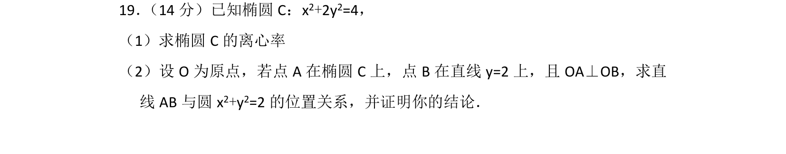
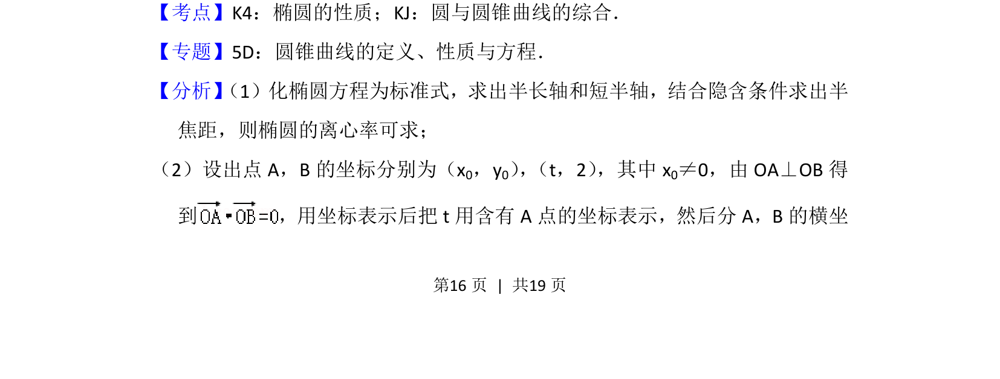
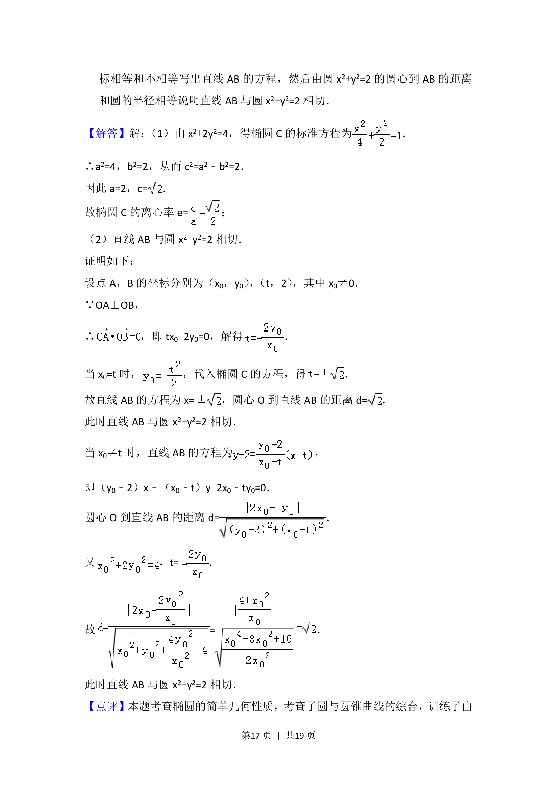
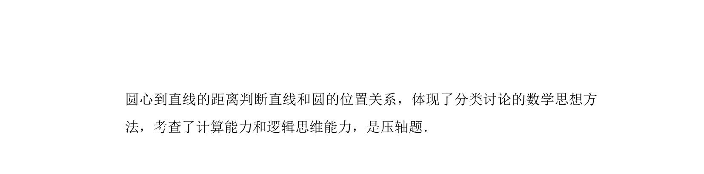

## 题面

## 摘要

求椭圆离心率，并讨论给定条件下直线与圆的位置关系。

## 关联考点

- [[944-椭圆的性质|椭圆的性质]]
- [[圆与圆锥曲线的综合]]

## 答案与解析

> 📄 原 PDF 第 16 页：`素材/真题/北京/2008-2024·（北京）数学高考真题/2014年高考数学试卷（理）（北京）（解析卷）.pdf`

<!-- 题干文本-start -->
## 题干文本
19． （14分）已知椭圆C：x2+2y2=4，
（1）求椭圆C的离心率
（2）设O为原点，若点A在椭圆C上，点B在直线y=2上，且OA⊥OB，求直
线AB与圆x 2+y2=2的位置关系，并证明你的结论．
<!-- 题干文本-end -->

<!-- 解析文本-start -->
## 解析文本
【考点】K4：椭圆的性质；KJ：圆与圆锥曲线的综合．菁优网版权所有
【专题】5D：圆锥曲线的定义、性质与方程．
【分析】 （1）化椭圆方程为标准式，求出半长轴和短半轴，结合隐含条件求出半
焦距，则椭圆的离心率可求；
（2）设出点A，B的坐标分别为（x 0，y0） ， （t，2） ，其中x0≠0，由OA⊥OB得
到 ，用坐标表示后把t用含有A点的坐标表示，然后分A，B的横坐
<!-- 解析文本-end -->
