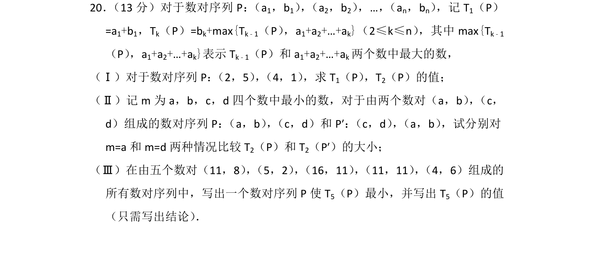
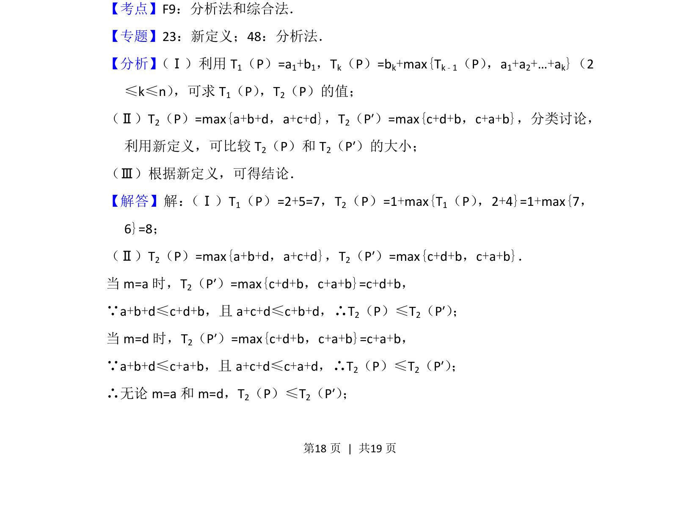
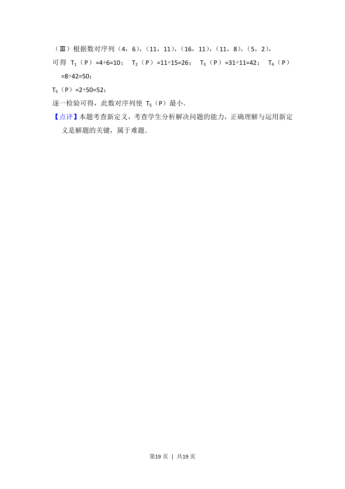

## 题面

## 摘要

本题考查新定义下的递推运算与大小比较，涉及数列对序列的求值、分类讨论及构造最优序列。

## 关联考点

- [[1385-新定义|新定义]]
- [[383-数列递推公式|递推关系]]
- [[最大值函数]]
- [[424-参数分类讨论|分类讨论]]

## 答案与解析

> 📄 原 PDF 第 18 页：`素材/真题/北京/2008-2024·（北京）数学高考真题/2014年高考数学试卷（理）（北京）（解析卷）.pdf`

<!-- 题干文本-start -->
## 题干文本
20． （13分）对于数对序列P： （a1，b1） ， （a2，b2） ，…， （an，bn） ，记T1（P）
=a1+b1，Tk（P）=bk+max{Tk﹣1（P） ，a1+a2+…+ak}（2≤k≤n） ，其中max{Tk﹣1
（P） ，a1+a2+…+ak}表示T k﹣1（P）和a 1+a2+…+ak两个数中最大的数，
（Ⅰ）对于数对序列P： （2，5） ， （4，1） ，求T1（P） ，T2（P）的值；
（Ⅱ）记m为a，b，c，d四个数中最小的数，对于由两个数对（a，b） ， （c，
d）组成的数对序列P： （a，b） ， （c，d）和P′： （c，d） ， （a，b） ，试分别对
m=a和m=d两种情况比较T 2（P）和T 2（P′）的大小；
（Ⅲ）在由五个数对（11，8） ， （5，2） ， （16，11） ， （11，11） ， （4，6）组成的
所有数对序列中，写出一个数对序列P使T 5（P）最小，并写出T 5（P）的值
（只需写出结论） ．
<!-- 题干文本-end -->

<!-- 解析文本-start -->
## 解析文本
【考点】F9：分析法和综合法．菁优网版权所有
【专题】23：新定义；48：分析法．
【分析】 （Ⅰ）利用T1（P）=a1+b1，Tk（P）=bk+max{Tk﹣1（P） ，a1+a2+…+ak}（2
≤k≤n） ，可求T1（P） ，T2（P）的值；
（Ⅱ）T2（P）=max{a+b+d，a+c+d}，T2（P′）=max{c+d+b，c+a+b}，分类讨论，
利用新定义，可比较T 2（P）和T 2（P′）的大小；
（Ⅲ）根据新定义，可得结论．
【解答】解： （Ⅰ）T1（P）=2+5=7，T 2（P）=1+max{T1（P） ，2+4}=1+max{7，
6}=8；
（Ⅱ）T2（P）=max{a+b+d，a+c+d}，T2（P′）=max{c+d+b，c+a+b}．
当m=a时，T 2（P′）=max{c+d+b，c+a+b}=c+d+b，
∵a+b+d≤c+d+b，且a+c+d≤c+b+d，∴T 2（P）≤T2（P′） ；
当m=d时，T 2（P′）=max{c+d+b，c+a+b}=c+a+b，
∵a+b+d≤c+a+b，且a+c+d≤c+a+d，∴T 2（P）≤T2（P′） ；
∴无论m=a和m=d，T 2（P）≤T2（P′） ；
<!-- 解析文本-end -->
