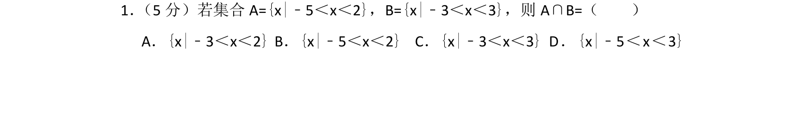
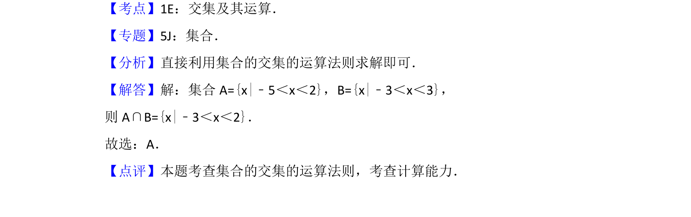

## 题面

## 摘要

本题考查集合交集运算，给出两个连续不等式的集合求其公共部分。

## 关联考点

- [[1139-集合的交集|集合的交集]]
- [[083-不等式|不等式]]

## 答案与解析

> 📄 原 PDF 第 1 页：`素材/真题/北京/2008-2024·（北京）数学高考真题/2015年高考数学试卷（文）（北京）（解析卷）.pdf`

<!-- 题干文本-start -->
## 题干文本
1． （5分）若集合A={x|﹣5＜x＜2}，B={x|﹣3＜x＜3}，则A∩B=（　　）
A．{x|﹣3＜x＜2}B．{x|﹣5＜x＜2}C．{x|﹣3＜x＜3}D．{x|﹣5＜x＜3}
<!-- 题干文本-end -->

<!-- 解析文本-start -->
## 解析文本
【考点】1E：交集及其运算．菁优网版权所有
【专题】5J：集合．
【分析】直接利用集合的交集的运算法则求解即可．
【解答】解：集合A={x|﹣5＜x＜2}，B={x|﹣3＜x＜3}，
则A∩B={x|﹣3＜x＜2}．
故选：A．
【点评】本题考查集合的交集的运算法则，考查计算能力．
<!-- 解析文本-end -->
