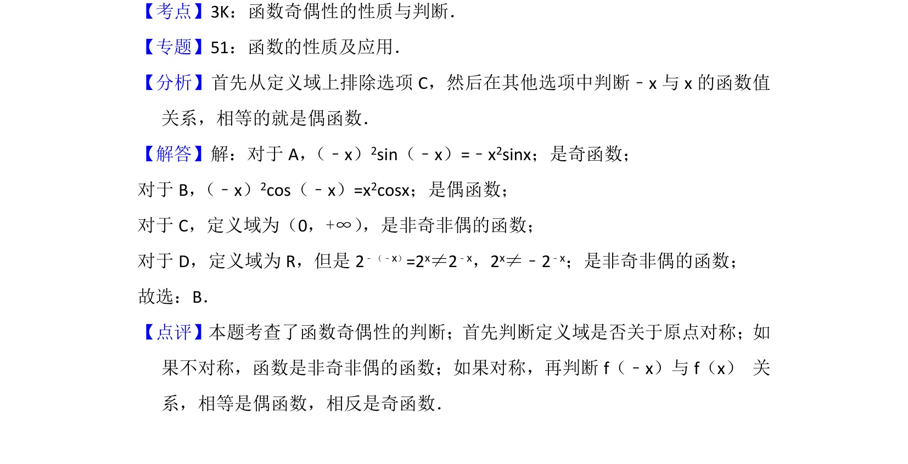

## 题面

## 摘要

考查函数奇偶性的判断，先看定义域对称性，再比较f(-x)与f(x)的关系。

## 关联考点

- [[284-函数的奇偶性|函数奇偶性]]
- [[014-对称|定义域对称性]]

## 答案与解析

> 📄 原 PDF 第 2 页：`素材/真题/北京/2008-2024·（北京）数学高考真题/2015年高考数学试卷（文）（北京）（解析卷）.pdf`

<!-- 题干文本-start -->
## 题干文本
3． （5分）下列函数中为偶函数的是（　　）
A．y=x2sinx B．y=x 2cosx C．y=|lnx|D．y=2 ﹣x
<!-- 题干文本-end -->

<!-- 解析文本-start -->
## 解析文本
【考点】3K：函数奇偶性的性质与判断．菁优网版权所有
【专题】51：函数的性质及应用．
【分析】首先从定义域上排除选项C，然后在其他选项中判断﹣x与x的函数值
关系，相等的就是偶函数．
【解答】解：对于A， （﹣x）2sin（﹣x）=﹣x2sinx；是奇函数；
对于B， （﹣x）2cos（﹣x）=x2cosx；是偶函数；
对于C，定义域为（0，+∞） ，是非奇非偶的函数；
对于D，定义域为R，但是2 ﹣（﹣x）=2x≠2﹣x，2x≠﹣2﹣x；是非奇非偶的函数；
故选：B．
【点评】本题考查了函数奇偶性的判断；首先判断定义域是否关于原点对称；如
果不对称，函数是非奇非偶的函数；如果对称，再判断f（﹣x）与f（x） 关
系，相等是偶函数，相反是奇函数．
<!-- 解析文本-end -->
