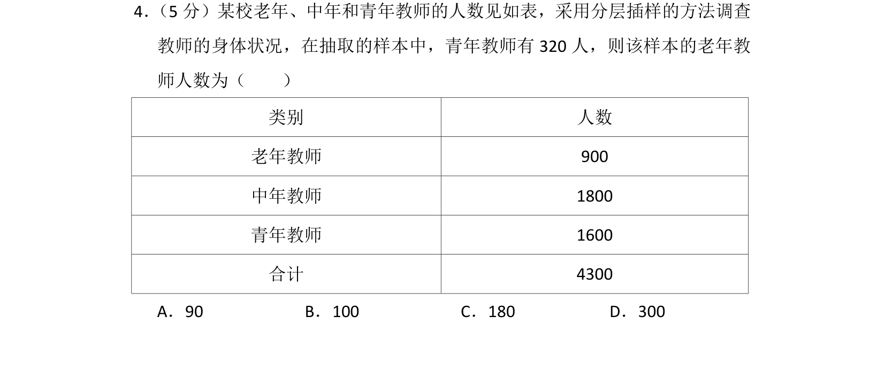
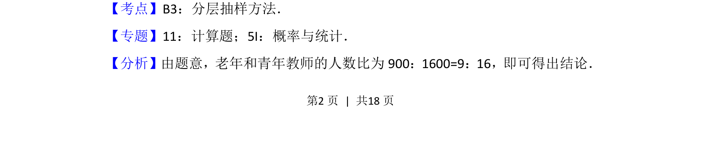
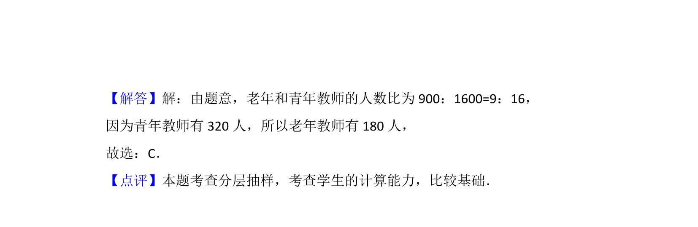

## 题面

## 摘要

考查分层抽样方法，通过比例关系计算样本中老年教师人数。

## 关联考点

- [[319-分层抽样|分层抽样]]
- [[比例关系]]

## 答案与解析

> 📄 原 PDF 第 2 页：`素材/真题/北京/2008-2024·（北京）数学高考真题/2015年高考数学试卷（文）（北京）（解析卷）.pdf`

<!-- 题干文本-start -->
## 题干文本
4． （5分）某校老年、中年和青年教师的人数见如表，采用分层插样的方法调查
教师的身体状况，在抽取的样本中，青年教师有320人，则该样本的老年教
师人数为（　　）
类别 人数
老年教师 900
中年教师 1800
青年教师 1600
合计 4300
A．90 B．100 C．180 D．300
<!-- 题干文本-end -->

<!-- 解析文本-start -->
## 解析文本
【考点】B3：分层抽样方法．菁优网版权所有
【专题】11：计算题；5I：概率与统计．
【分析】由题意，老年和青年教师的人数比为900：1600=9：16，即可得出结论．
<!-- 解析文本-end -->
