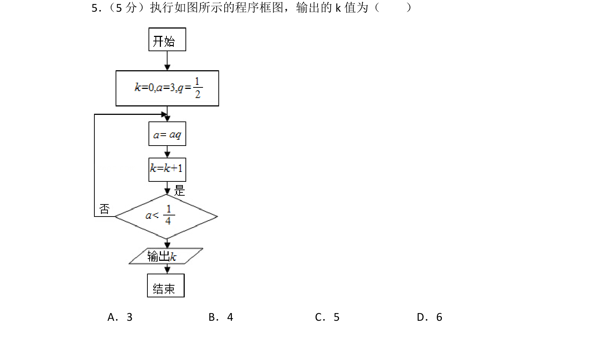
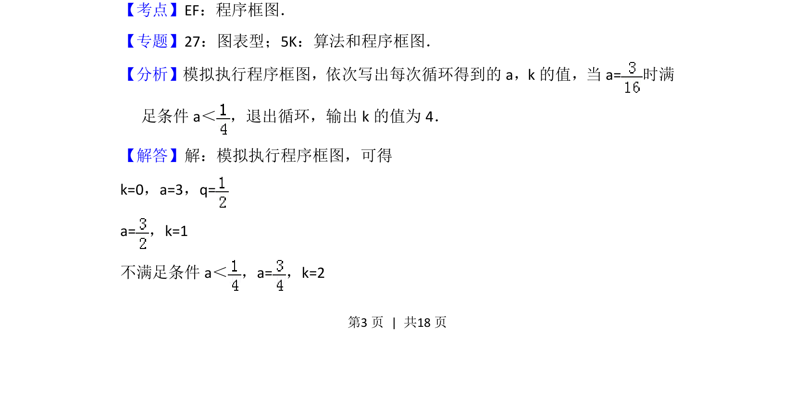
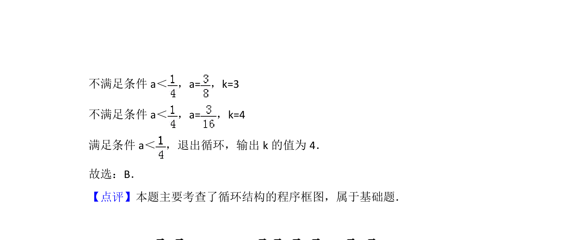

## 题面

## 摘要

该题考查程序框图的执行过程，通过模拟循环结构计算输出k值。

## 关联考点

- [[1042-程序框图|程序框图]]
- [[870-循环结构|循环结构]]
- [[模拟执行]]

## 答案与解析

> 📄 原 PDF 第 3 页：`素材/真题/北京/2008-2024·（北京）数学高考真题/2015年高考数学试卷（文）（北京）（解析卷）.pdf`

<!-- 题干文本-start -->
## 题干文本
5． （5分）执行如图所示的程序框图，输出的k值为（　　）
A．3 B．4 C．5 D．6
<!-- 题干文本-end -->

<!-- 解析文本-start -->
## 解析文本
【考点】EF：程序框图．菁优网版权所有
【专题】27：图表型；5K：算法和程序框图．
【分析】模拟执行程序框图，依次写出每次循环得到的a，k的值，当a=时满
足条件a＜ ，退出循环，输出k的值为4．
【解答】解：模拟执行程序框图，可得
k=0，a=3，q=
a=，k=1
不满足条件a＜ ，a=，k=2
<!-- 解析文本-end -->
