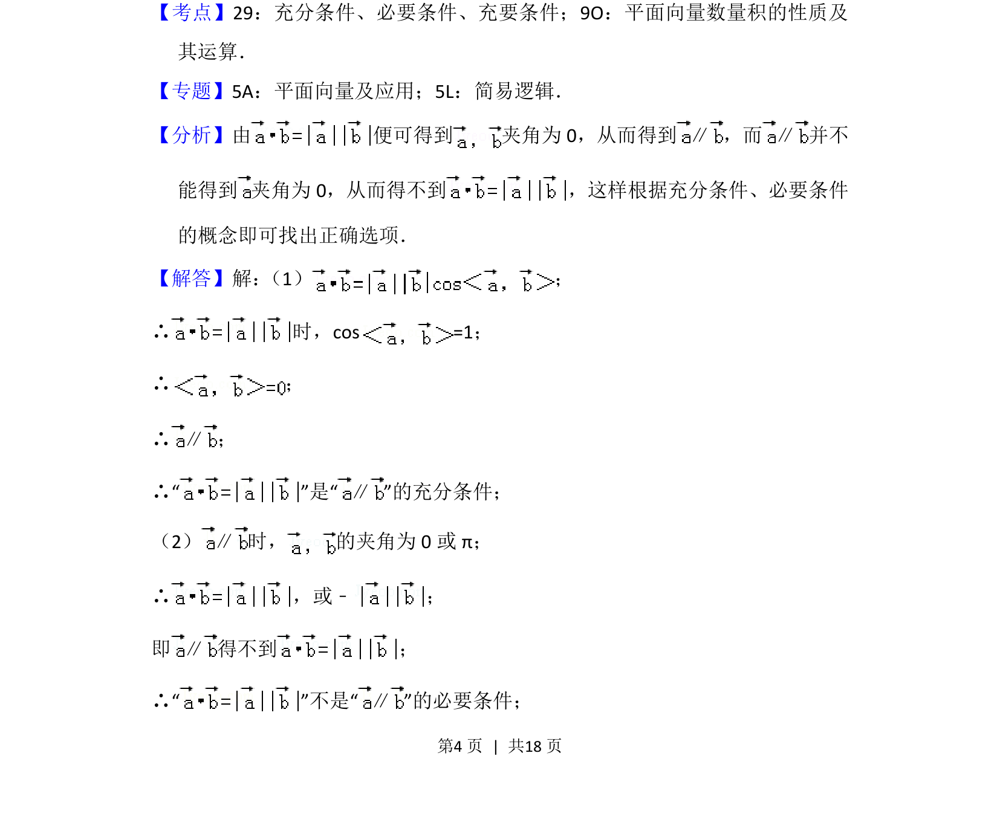
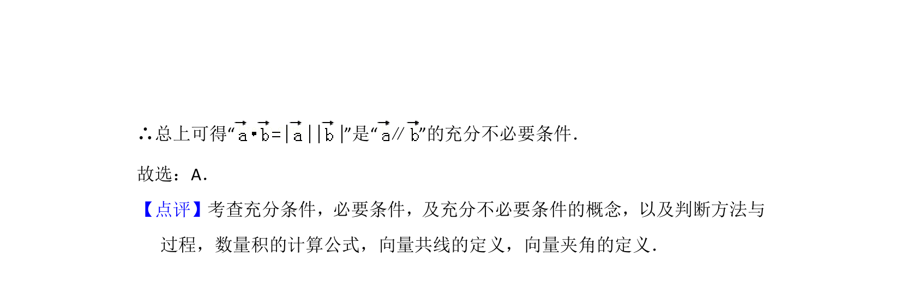

## 题面

## 摘要

向量共线与数量积的充分必要条件判断。

## 关联考点

- [[279-充要条件|充要条件]]
- [[854-平面向量数量积|平面向量数量积]]
- [[743-向量共线|向量共线]]

## 答案与解析

> 📄 原 PDF 第 4 页：`素材/真题/北京/2008-2024·（北京）数学高考真题/2015年高考数学试卷（文）（北京）（解析卷）.pdf`

<!-- 题干文本-start -->
## 题干文本
6． （5分）设 ， 是非零向量，“ =| || |”是“ ”的（　　）
A．充分而不必要条件B．必要而不充分条件
C．充分必要条件D．既不充分也不必要条件
<!-- 题干文本-end -->

<!-- 解析文本-start -->
## 解析文本
【考点】29：充分条件、必要条件、充要条件；9O：平面向量数量积的性质及
其运算．菁优网版权所有
【专题】5A：平面向量及应用；5L：简易逻辑．
【分析】由 便可得到 夹角为0，从而得到 ∥ ，而 ∥ 并不
能得到 夹角为0，从而得不到 ，这样根据充分条件、必要条件
的概念即可找出正确选项．
【解答】解： （1） ；
∴ 时，cos =1；
∴ ；
∴ ∥ ；
∴“ ”是“∥”的充分条件；
（2） ∥ 时， 的夹角为0或π；
∴ ，或﹣；
即 ∥ 得不到 ；
∴“ ”不是“∥”的必要条件；
<!-- 解析文本-end -->
