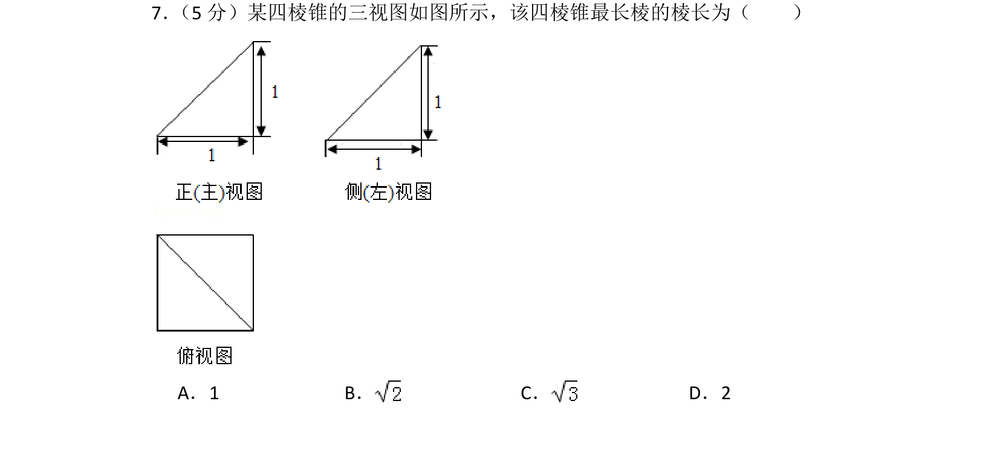
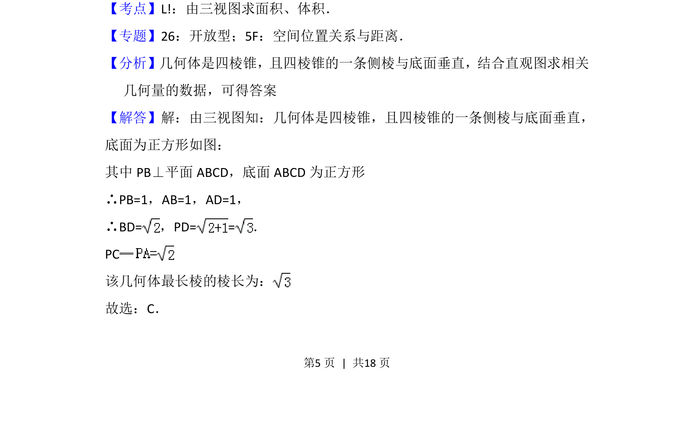
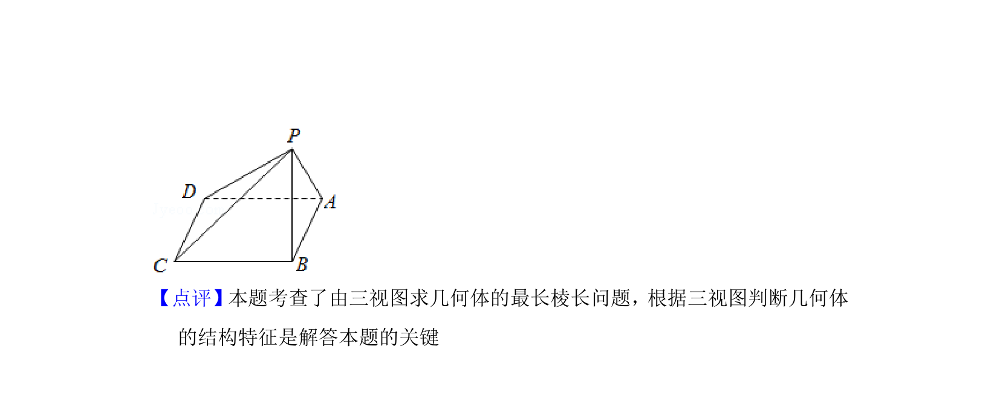

## 题面

## 摘要

根据三视图还原四棱锥的结构，并计算其最长棱的棱长。

## 关联考点

- [[235-三视图|三视图]]
- [[1045-空间几何体|空间几何体]]
- [[1389-棱长计算|棱长计算]]
- [[1372-四棱锥|四棱锥]]

## 答案与解析

> 📄 原 PDF 第 5 页：`素材/真题/北京/2008-2024·（北京）数学高考真题/2015年高考数学试卷（文）（北京）（解析卷）.pdf`
