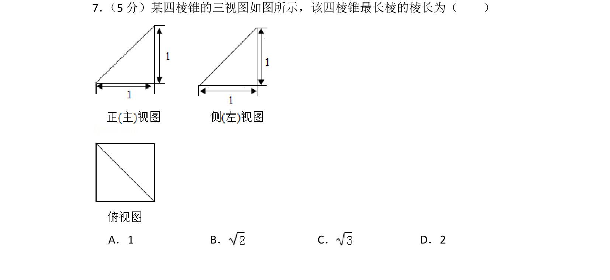
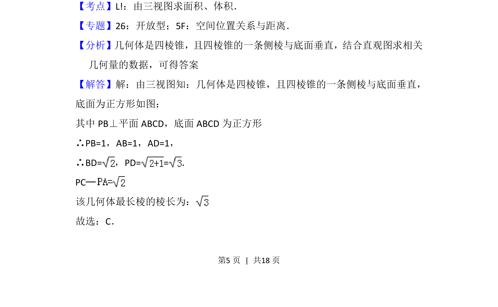
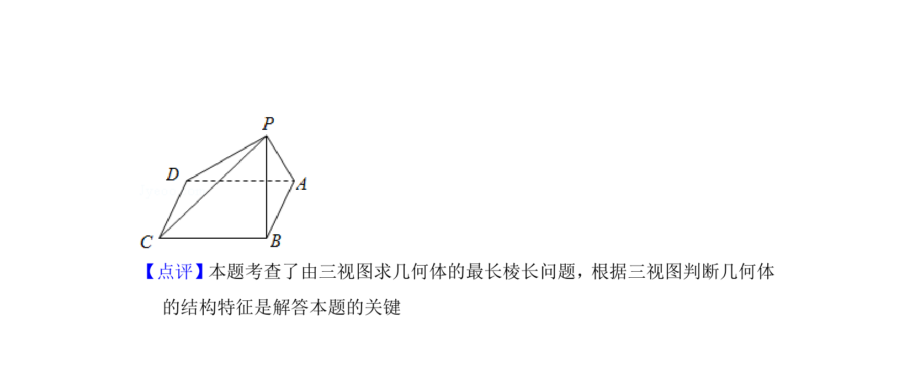

## 题面

## 摘要

根据三视图还原四棱锥的结构，并计算其最长棱的棱长。

## 关联考点

- [[235-三视图|三视图]]
- [[1045-空间几何体|空间几何体]]
- [[1389-棱长计算|棱长计算]]
- [[1372-四棱锥|四棱锥]]

## 答案与解析

> 📄 原 PDF 第 5 页：`素材/真题/北京/2008-2024·（北京）数学高考真题/2015年高考数学试卷（文）（北京）（解析卷）.pdf`

<!-- 题干文本-start -->
## 题干文本
7． （5分）某四棱锥的三视图如图所示，该四棱锥最长棱的棱长为（　　）
A．1 B．C．D．2
<!-- 题干文本-end -->

<!-- 解析文本-start -->
## 解析文本
【考点】L!：由三视图求面积、体积．菁优网版权所有
【专题】26：开放型；5F：空间位置关系与距离．
【分析】几何体是四棱锥，且四棱锥的一条侧棱与底面垂直，结合直观图求相关
几何量的数据，可得答案
【解答】解：由三视图知：几何体是四棱锥，且四棱锥的一条侧棱与底面垂直，
底面为正方形如图：
其中PB⊥平面ABCD，底面ABCD为正方形
∴PB=1，AB=1，AD=1，
∴BD=，PD= =．
PC═
该几何体最长棱的棱长为：
故选：C．
<!-- 解析文本-end -->
