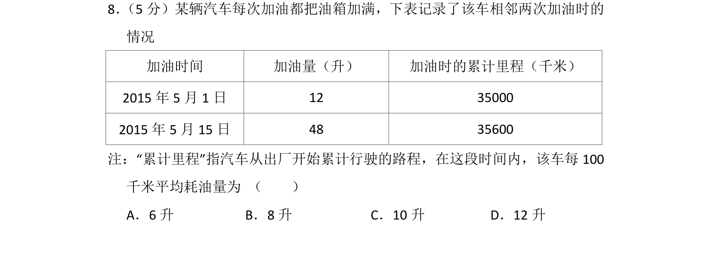
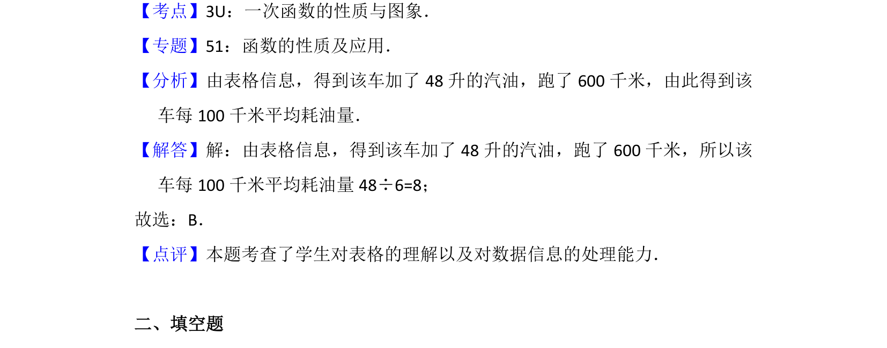

## 题面

## 摘要

利用加油量与行驶里程计算平均油耗，考查数据信息处理能力。

## 关联考点

- [[177-一次函数定义|一次函数]]
- [[901-数据处理|数据处理]]
- [[比值计算]]

## 答案与解析

> 📄 原 PDF 第 6 页：`素材/真题/北京/2008-2024·（北京）数学高考真题/2015年高考数学试卷（文）（北京）（解析卷）.pdf`

<!-- 题干文本-start -->
## 题干文本
8． （5分）某辆汽车每次加油都把油箱加满，下表记录了该车相邻两次加油时的
情况
加油时间 加油量（升） 加油时的累计里程（千米）
2015年5月1日 12 35000
2015年5月15日 48 35600
注：“累计里程”指汽车从出厂开始累计行驶的路程，在这段时间内，该车每100
千米平均耗油量为 （　　）
A．6升B．8升C．10升D．12升
<!-- 题干文本-end -->

<!-- 解析文本-start -->
## 解析文本
【考点】3U：一次函数的性质与图象．菁优网版权所有
【专题】51：函数的性质及应用．
【分析】由表格信息，得到该车加了48升的汽油，跑了600千米，由此得到该
车每100千米平均耗油量．
【解答】解：由表格信息，得到该车加了48升的汽油，跑了600千米，所以该
车每100千米平均耗油量48÷6=8；
故选：B．
【点评】本题考查了学生对表格的理解以及对数据信息的处理能力．
　
二、填空题
<!-- 解析文本-end -->
