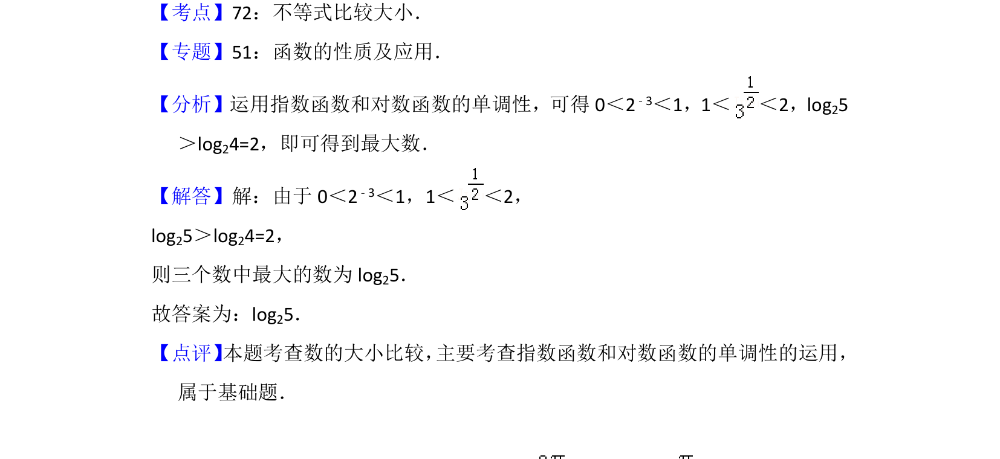

## 题面

## 摘要

比较指数、对数式的大小，利用函数单调性确定最大数。

## 关联考点

- [[890-数值比较|不等式比较大小]]
- [[553-指数函数单调性|指数函数单调性]]
- [[828-对数函数单调性|对数函数单调性]]

## 答案与解析

> 📄 原 PDF 第 7 页：`素材/真题/北京/2008-2024·（北京）数学高考真题/2015年高考数学试卷（文）（北京）（解析卷）.pdf`
