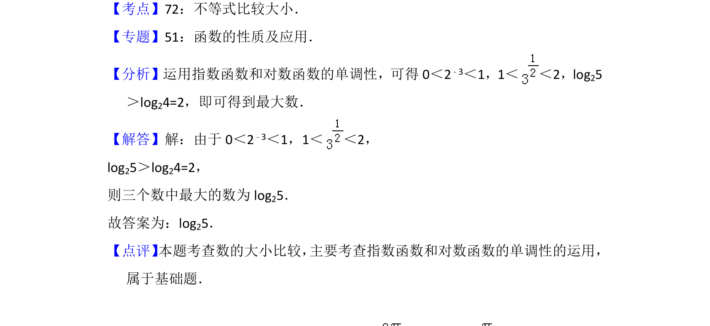

## 题面

## 摘要

比较指数、对数式的大小，利用函数单调性确定最大数。

## 关联考点

- [[889-数值比较|不等式比较大小]]
- [[553-指数函数单调性|指数函数单调性]]
- [[827-对数函数单调性|对数函数单调性]]

## 答案与解析

> 📄 原 PDF 第 7 页：`素材/真题/北京/2008-2024·（北京）数学高考真题/2015年高考数学试卷（文）（北京）（解析卷）.pdf`

<!-- 题干文本-start -->
## 题干文本
10． （5分）2﹣3， ，log 25三个数中最大数的是　log 25　．
<!-- 题干文本-end -->

<!-- 解析文本-start -->
## 解析文本
【考点】72：不等式比较大小．菁优网版权所有
【专题】51：函数的性质及应用．
【分析】运用指数函数和对数函数的单调性，可得0＜2﹣3＜1，1＜ ＜2，log 25
＞log24=2，即可得到最大数．
【解答】解：由于0＜2 ﹣3＜1，1＜ ＜2，
log25＞log24=2，
则三个数中最大的数为log 25．
故答案为：log25．
【点评】 本题考查数的大小比较， 主要考查指数函数和对数函数的单调性的运用，
属于基础题．
<!-- 解析文本-end -->
