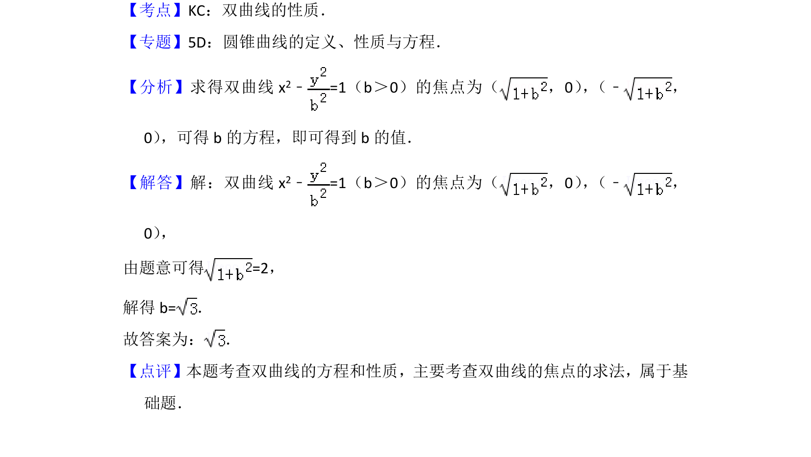

## 题面

## 摘要

已知双曲线焦点坐标求参数b，利用双曲线标准方程和焦点关系求解

## 关联考点

- [[731-双曲线的性质|双曲线的性质]]
- [[双曲线的焦点]]

## 答案与解析

> 📄 原 PDF 第 8 页：`素材/真题/北京/2008-2024·（北京）数学高考真题/2015年高考数学试卷（文）（北京）（解析卷）.pdf`

<!-- 题干文本-start -->
## 题干文本
12． （5分）已知（2，0）是双曲线x2﹣=1（b＞0）的一个焦点，则b=　 　．
<!-- 题干文本-end -->

<!-- 解析文本-start -->
## 解析文本
【考点】KC：双曲线的性质．菁优网版权所有
【专题】5D：圆锥曲线的定义、性质与方程．
【分析】求得双曲线x 2﹣=1（b＞0）的焦点为（ ，0） ， （﹣，
0） ，可得b的方程，即可得到b的值．
【解答】解：双曲线x 2﹣=1（b＞0）的焦点为（ ，0） ， （﹣，
0） ，
由题意可得=2，
解得b=．
故答案为： ．
【点评】本题考查双曲线的方程和性质，主要考查双曲线的焦点的求法，属于基
础题．
<!-- 解析文本-end -->
