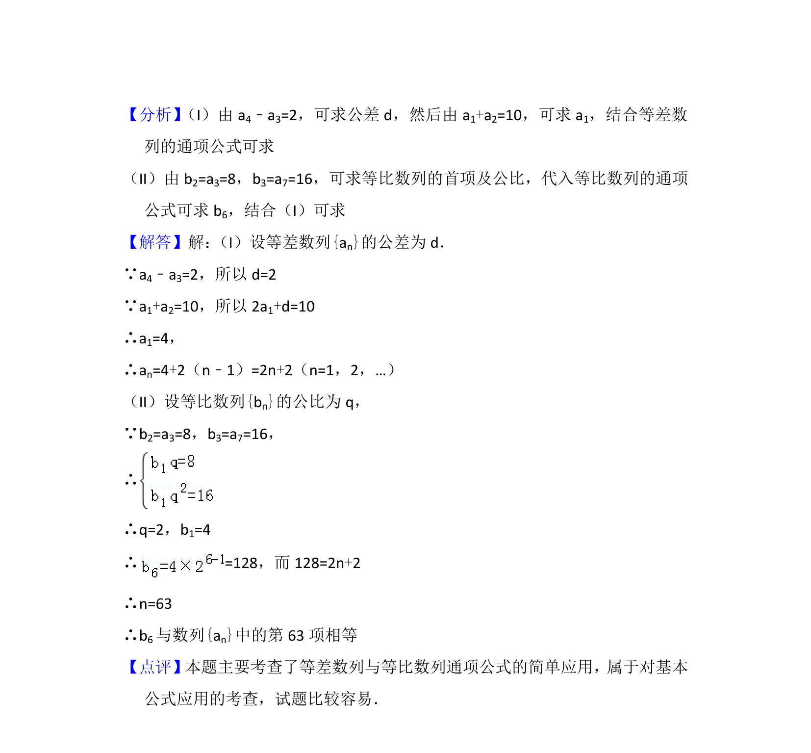

## 题面

## 摘要

等差数列通项公式求解，结合等比数列项求等差数列对应项序号

## 关联考点

- [[1062-等差数列的通项公式|等差数列的通项公式]]
- [[1061-等差数列的性质|等差数列的性质]]
- [[1069-等比数列的通项公式|等比数列的通项公式]]
- [[数列与方程]]

## 答案与解析

> 📄 原 PDF 第 11 页：`素材/真题/北京/2008-2024·（北京）数学高考真题/2015年高考数学试卷（文）（北京）（解析卷）.pdf`
