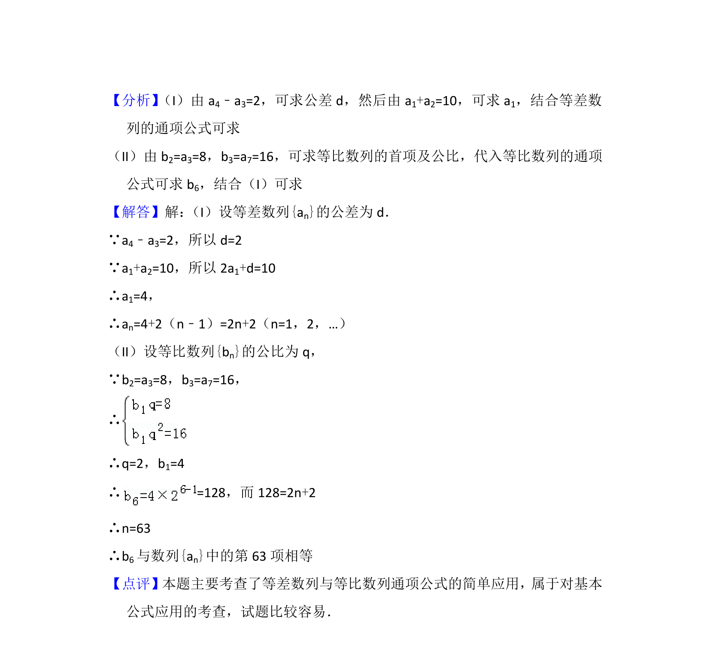

## 题面

## 摘要

等差数列通项公式求解，结合等比数列项求等差数列对应项序号

## 关联考点

- [[1063-等差数列通项公式|等差数列的通项公式]]
- [[412-等差数列性质|等差数列的性质]]
- [[1070-等比数列通项公式|等比数列的通项公式]]
- [[数列与方程]]

## 答案与解析

> 📄 原 PDF 第 11 页：`素材/真题/北京/2008-2024·（北京）数学高考真题/2015年高考数学试卷（文）（北京）（解析卷）.pdf`

<!-- 题干文本-start -->
## 题干文本
16． （13分）已知等差数列{an}满足a 1+a2=10，a4﹣a3=2
（1）求{an}的通项公式；
（2）设等比数列{bn}满足b 2=a3，b3=a7，问：b6与数列{an}的第几项相等？
<!-- 题干文本-end -->

<!-- 解析文本-start -->
## 解析文本
【考点】83：等差数列的性质．菁优网版权所有
【专题】11：计算题；54：等差数列与等比数列．
<!-- 解析文本-end -->
