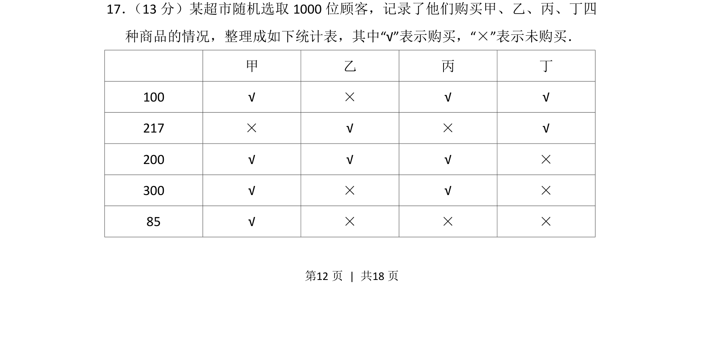
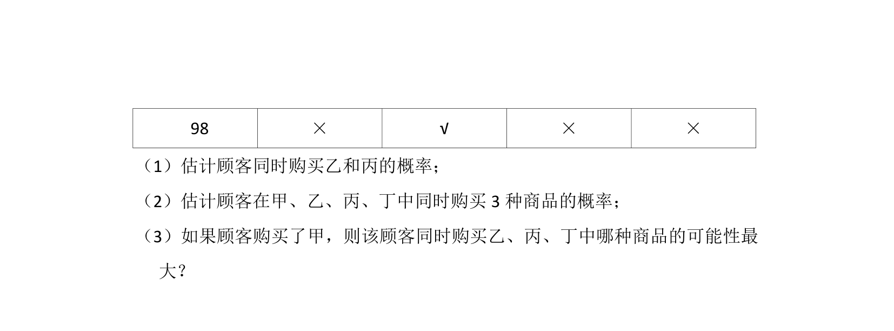
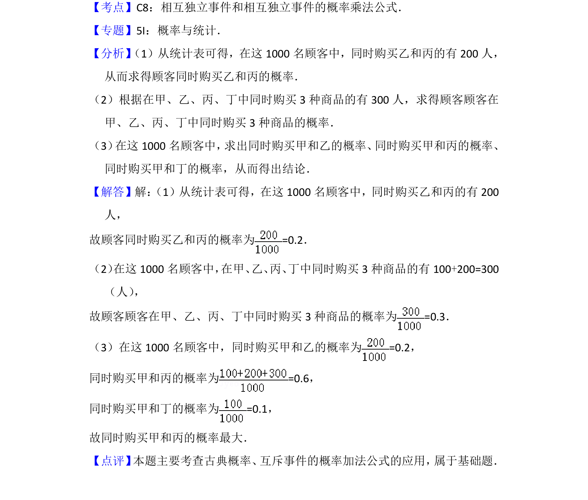

## 题面

## 摘要

根据统计表分析顾客购买组合的频数分布及概率计算

## 关联考点

- [[统计表]]
- [[143-频数分布|频数]]
- [[945-概率|概率]]
- [[899-数据分析|数据分析]]

## 答案与解析

> 📄 原 PDF 第 12 页：`素材/真题/北京/2008-2024·（北京）数学高考真题/2015年高考数学试卷（文）（北京）（解析卷）.pdf`
