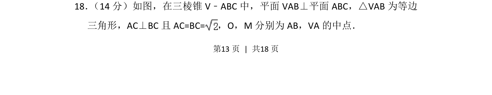
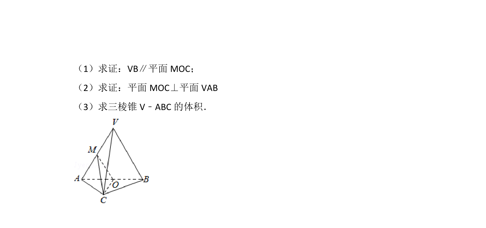
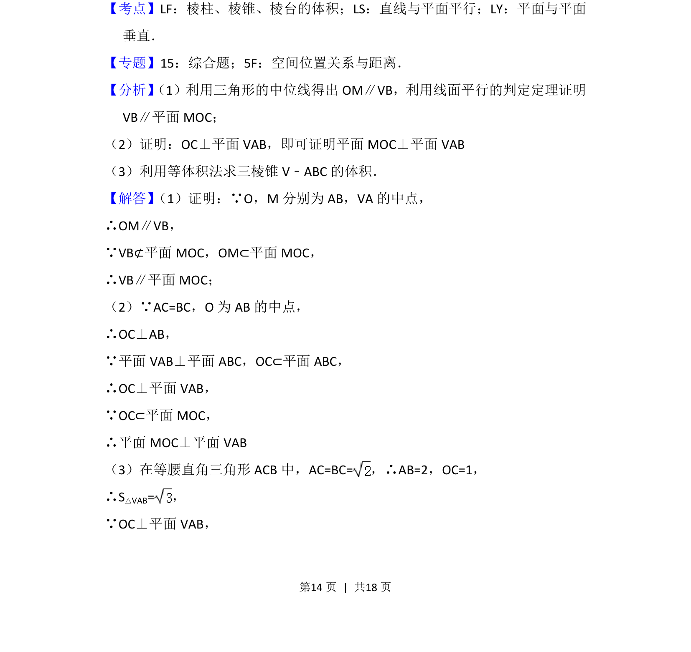
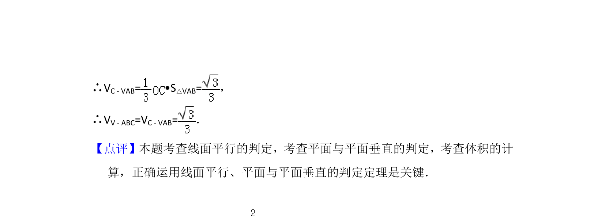

## 题面

## 摘要

考查三棱锥中面面垂直与线面垂直的转化，结合等边三角形及中点求证空间位置关系

## 关联考点

- [[351-空间直线平面垂直|面面垂直]]
- [[1086-线面垂直的判定与性质|线面垂直]]
- [[599-三棱锥|三棱锥]]

## 答案与解析

> 📄 原 PDF 第 13 页：`素材/真题/北京/2008-2024·（北京）数学高考真题/2015年高考数学试卷（文）（北京）（解析卷）.pdf`
