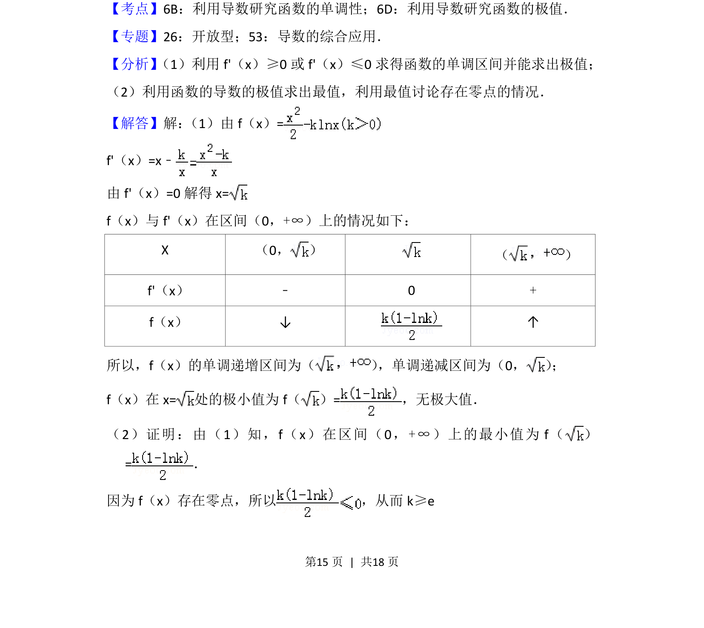
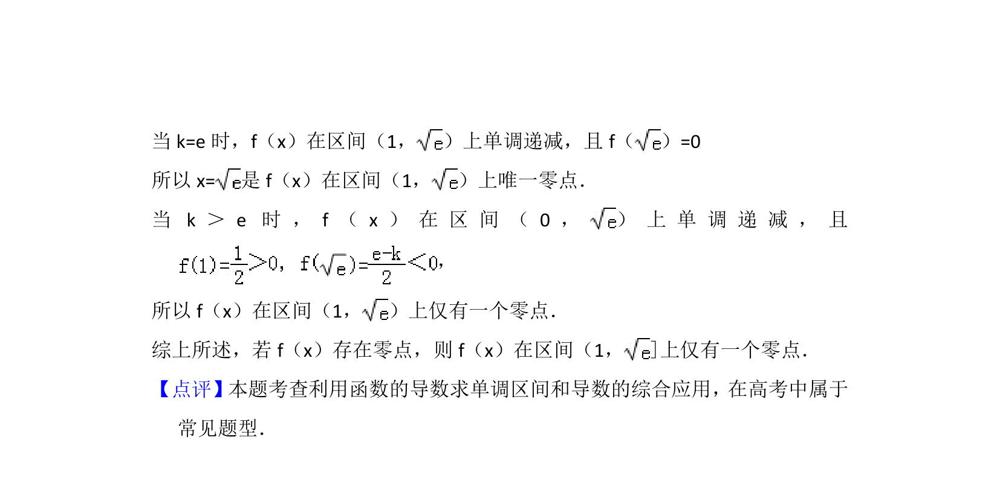

## 题面

## 摘要

求函数的单调区间与极值，并证明零点存在时在特定区间上零点唯一。

## 关联考点

- [[705-利用导数研究函数的单调性|利用导数研究函数的单调性]]
- [[707-利用导数研究函数的极值|利用导数研究函数的极值]]
- [[函数零点的判定]]

## 答案与解析

> 📄 原 PDF 第 15 页：`素材/真题/北京/2008-2024·（北京）数学高考真题/2015年高考数学试卷（文）（北京）（解析卷）.pdf`
