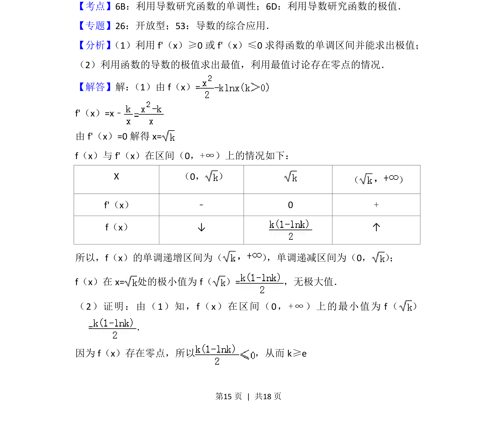
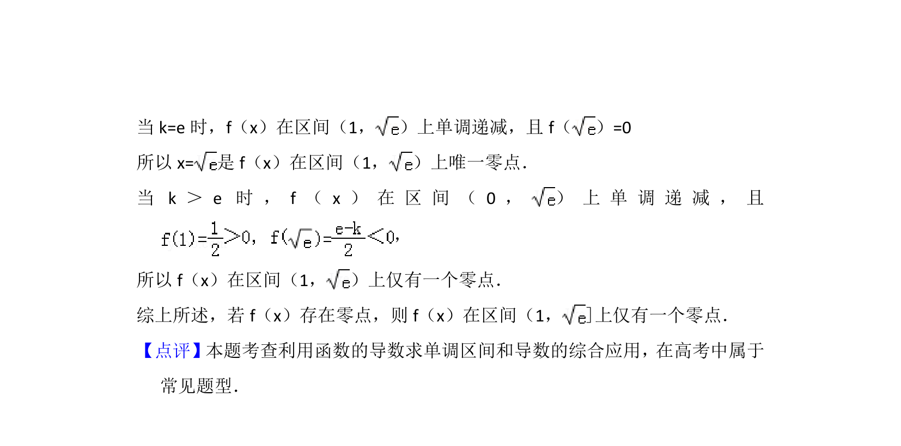

## 题面

## 摘要

求函数的单调区间与极值，并证明零点存在时在特定区间上零点唯一。

## 关联考点

- [[705-利用导数研究函数的单调性|利用导数研究函数的单调性]]
- [[707-利用导数研究函数的极值|利用导数研究函数的极值]]
- [[函数零点的判定]]

## 答案与解析

> 📄 原 PDF 第 15 页：`素材/真题/北京/2008-2024·（北京）数学高考真题/2015年高考数学试卷（文）（北京）（解析卷）.pdf`

<!-- 题干文本-start -->
## 题干文本
19． （13分）设函数f（x）=﹣klnx，k＞0．
（1）求f（x）的单调区间和极值；
（2）证明：若f（x）存在零点，则f（x）在区间（1，]上仅有一个零点．
<!-- 题干文本-end -->

<!-- 解析文本-start -->
## 解析文本
【考点】6B：利用导数研究函数的单调性；6D：利用导数研究函数的极值．菁优网版权所有
【专题】26：开放型；53：导数的综合应用．
【分析】 （1）利用f'（x）≥0或f'（x）≤0求得函数的单调区间并能求出极值；
（2）利用函数的导数的极值求出最值，利用最值讨论存在零点的情况．
【解答】解： （1）由f（x）=
f'（x）=x﹣
由f'（x）=0解得x=
f（x）与f'（x）在区间（0，+∞）上的情况如下：
X  （0，
 ）  
  （
 ）
 f'（x） ﹣  0 +
 f（x） ↓  
 ↑
所以，f（x）的单调递增区间为（ ） ，单调递减区间为（0， ） ；
f（x）在x=处的极小值为f（ ）=，无极大值．
（2）证明：由（1）知，f（x）在区间（0，+∞）上的最小值为f（ ）
=．
因为f（x）存在零点，所以 ，从而k≥e
<!-- 解析文本-end -->
