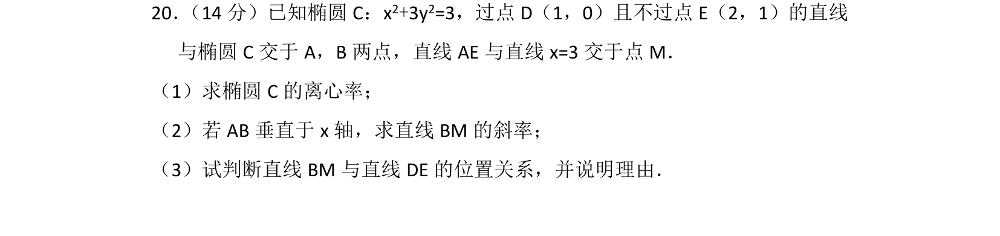
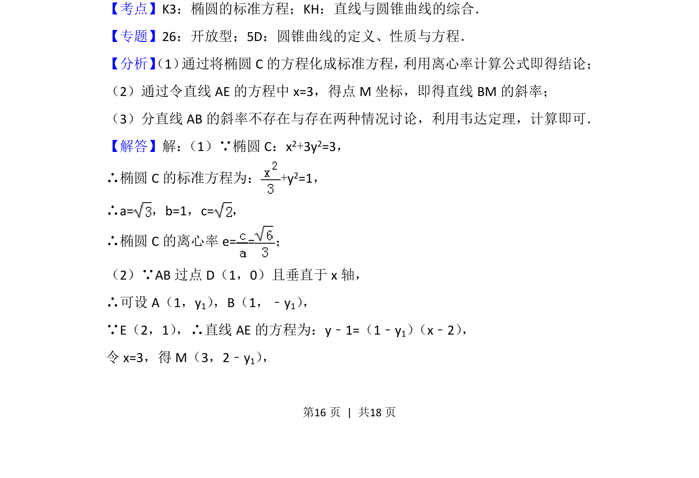
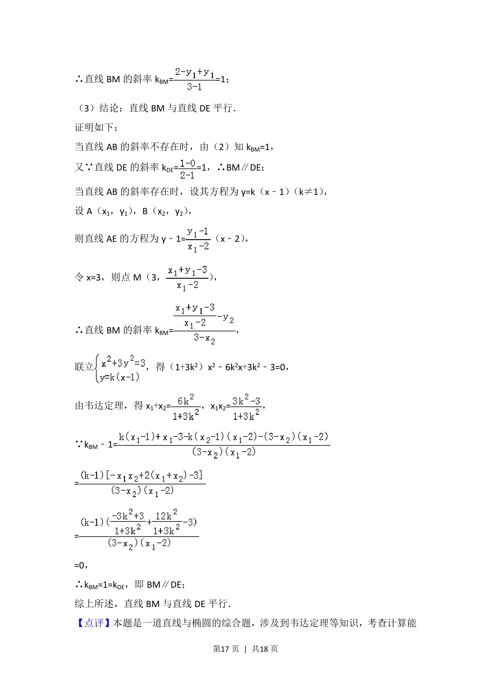
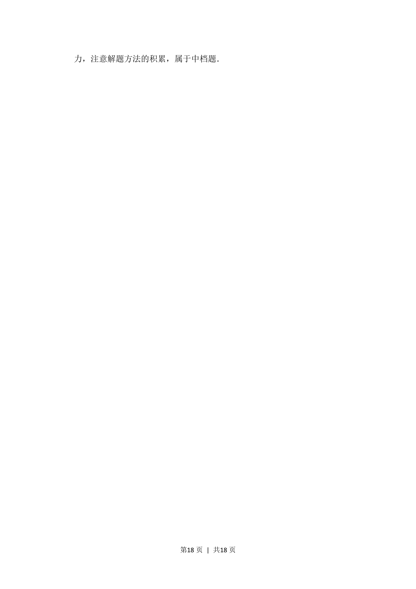

## 题面

## 摘要

椭圆方程与几何性质，直线与椭圆交点关系，位置关系判定

## 关联考点

- [[061-方程|椭圆的标准方程]]
- [[391-椭圆离心率|离心率]]
- [[1008-直线与圆锥曲线的综合|直线与圆锥曲线的综合]]

## 答案与解析

> 📄 原 PDF 第 16 页：`素材/真题/北京/2008-2024·（北京）数学高考真题/2015年高考数学试卷（文）（北京）（解析卷）.pdf`
