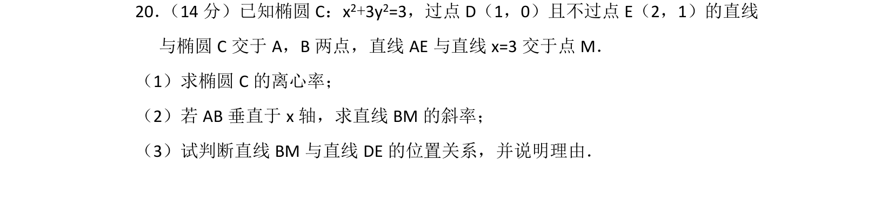
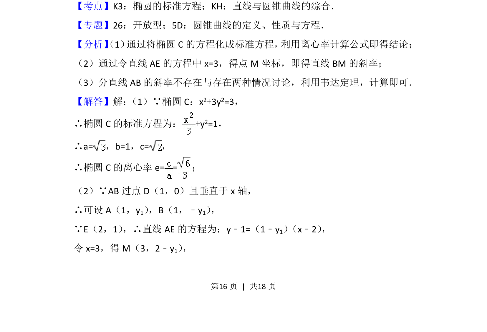
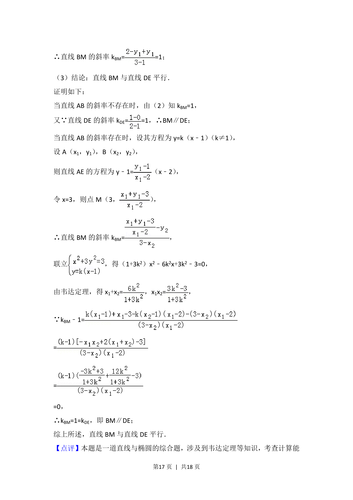
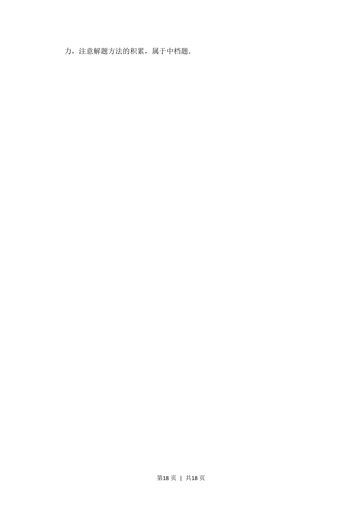

## 题面

## 摘要

椭圆方程与几何性质，直线与椭圆交点关系，位置关系判定

## 关联考点

- [[061-方程|椭圆的标准方程]]
- [[391-椭圆离心率|离心率]]
- [[1007-直线与圆锥曲线的综合|直线与圆锥曲线的综合]]

## 答案与解析

> 📄 原 PDF 第 16 页：`素材/真题/北京/2008-2024·（北京）数学高考真题/2015年高考数学试卷（文）（北京）（解析卷）.pdf`

<!-- 题干文本-start -->
## 题干文本
20． （14分）已知椭圆C：x2+3y2=3，过点D（1，0）且不过点E（2，1）的直线
与椭圆C交于A，B两点，直线AE与直线x=3交于点M．
（1）求椭圆C的离心率；
（2）若AB垂直于x轴，求直线BM的斜率；
（3）试判断直线BM与直线DE的位置关系，并说明理由．
<!-- 题干文本-end -->

<!-- 解析文本-start -->
## 解析文本
【考点】K3：椭圆的标准方程；KH：直线与圆锥曲线的综合．菁优网版权所有
【专题】26：开放型；5D：圆锥曲线的定义、性质与方程．
【分析】 （1） 通过将椭圆C的方程化成标准方程， 利用离心率计算公式即得结论；
（2）通过令直线AE的方程中x=3，得点M坐标，即得直线BM的斜率；
（3）分直线AB的斜率不存在与存在两种情况讨论，利用韦达定理，计算即可．
【解答】解： （1）∵椭圆C：x2+3y2=3，
∴椭圆C的标准方程为：+y 2=1，
∴a=，b=1，c=，
∴椭圆C的离心率e= =；
（2）∵AB过点D（1，0）且垂直于x轴，
∴可设A（1，y 1） ，B（1，﹣y1） ，
∵E（2，1） ，∴直线AE的方程为：y﹣1=（1﹣y1） （x﹣2） ，
令x=3，得M（3，2﹣y 1） ，
<!-- 解析文本-end -->
