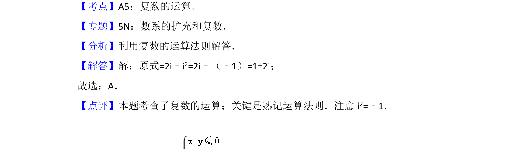

## 题面

## 摘要

考查复数乘法运算，需使用虚数单位i²=-1进行化简

## 关联考点

- [[811-复数运算|复数的运算]]

## 答案与解析

> 📄 原 PDF 第 1 页：`素材/真题/北京/2008-2024·（北京）数学高考真题/2015年高考数学试卷（理）（北京）（解析卷）.pdf`

<!-- 题干文本-start -->
## 题干文本
1． （5分）复数i（2﹣i）=（　　）
A．1+2i B．1﹣2i C．﹣1+2i D．﹣1﹣2i
<!-- 题干文本-end -->

<!-- 解析文本-start -->
## 解析文本
【考点】A5：复数的运算．菁优网版权所有
【专题】5N：数系的扩充和复数．
【分析】利用复数的运算法则解答．
【解答】解：原式=2i﹣i2=2i﹣（﹣1）=1+2i；
故选：A．
【点评】本题考查了复数的运算；关键是熟记运算法则．注意i 2=﹣1．
<!-- 解析文本-end -->
