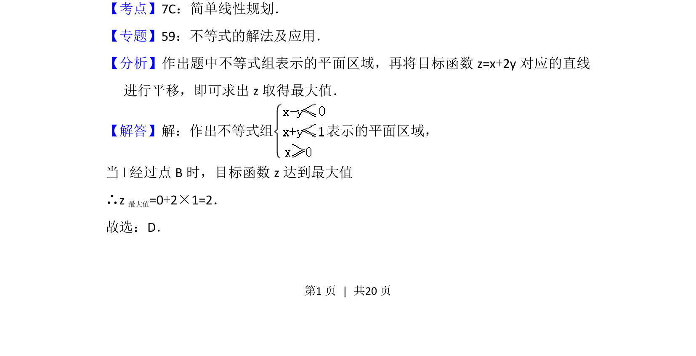
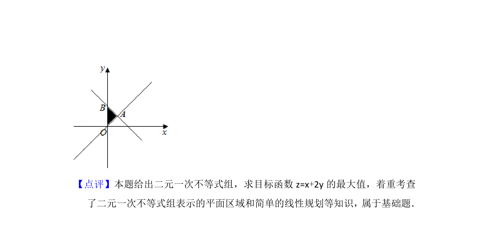

## 题面

## 摘要

考查线性规划中利用不等式组表示的可行域求目标函数最大值

## 关联考点

- [[1074-简单线性规划|简单线性规划]]
- [[1156-可行域|可行域]]
- [[1000-目标函数最值|目标函数最值]]

## 答案与解析

> 📄 原 PDF 第 1 页：`素材/真题/北京/2008-2024·（北京）数学高考真题/2015年高考数学试卷（理）（北京）（解析卷）.pdf`

<!-- 题干文本-start -->
## 题干文本
2． （5分）若x，y满足 ，则z=x+2y的最大值为（　　）
A．0 B．1 C．D．2
<!-- 题干文本-end -->

<!-- 解析文本-start -->
## 解析文本
【考点】7C：简单线性规划．菁优网版权所有
【专题】59：不等式的解法及应用．
【分析】作出题中不等式组表示的平面区域，再将目标函数z=x+2y对应的直线
进行平移，即可求出z取得最大值．
【解答】解：作出不等式组 表示的平面区域，
当l经过点B时，目标函数z达到最大值
∴z 最大值=0+2×1=2．
故选：D．
<!-- 解析文本-end -->
