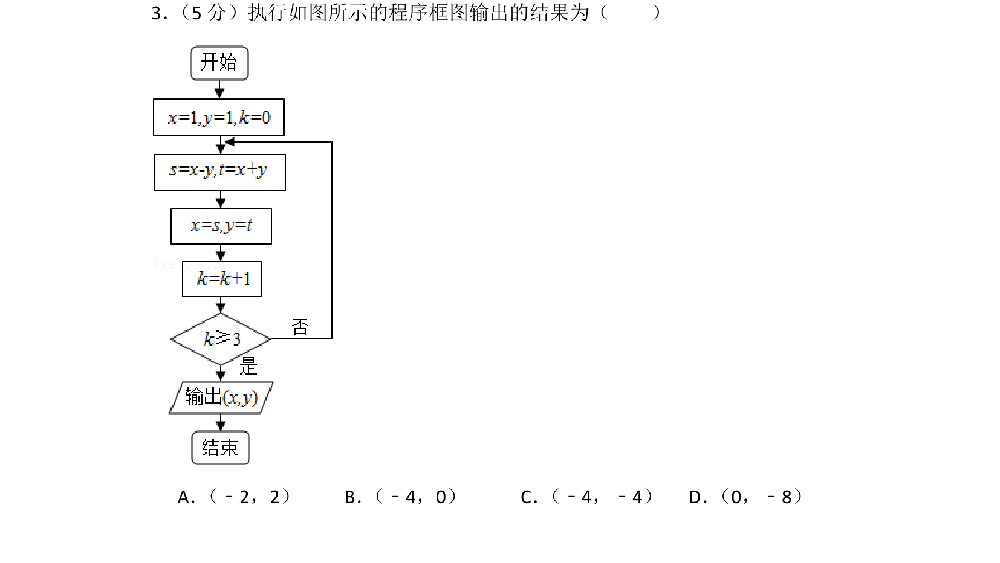
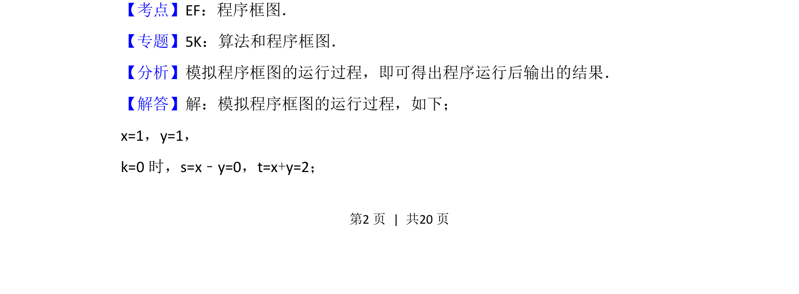
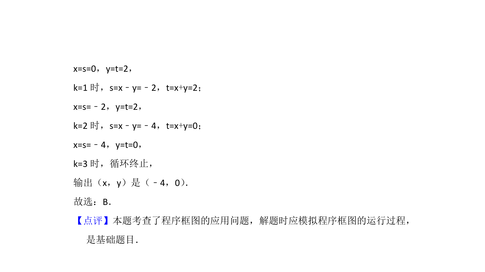

## 题面

## 摘要

该题考查程序框图的模拟执行，通过循环结构输出最终坐标结果

## 关联考点

- [[1042-程序框图|程序框图]]
- [[1075-算法|算法]]
- [[870-循环结构|循环结构]]

## 答案与解析

> 📄 原 PDF 第 2 页：`素材/真题/北京/2008-2024·（北京）数学高考真题/2015年高考数学试卷（理）（北京）（解析卷）.pdf`

<!-- 题干文本-start -->
## 题干文本
3． （5分）执行如图所示的程序框图输出的结果为（　　）
A． （﹣2，2）B． （﹣4，0）C． （﹣4，﹣4）D． （0，﹣8）
<!-- 题干文本-end -->

<!-- 解析文本-start -->
## 解析文本
【考点】EF：程序框图．菁优网版权所有
【专题】5K：算法和程序框图．
【分析】模拟程序框图的运行过程，即可得出程序运行后输出的结果．
【解答】解：模拟程序框图的运行过程，如下；
x=1，y=1，
k=0时，s=x﹣y=0，t=x+y=2；
<!-- 解析文本-end -->
