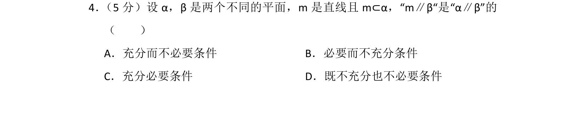
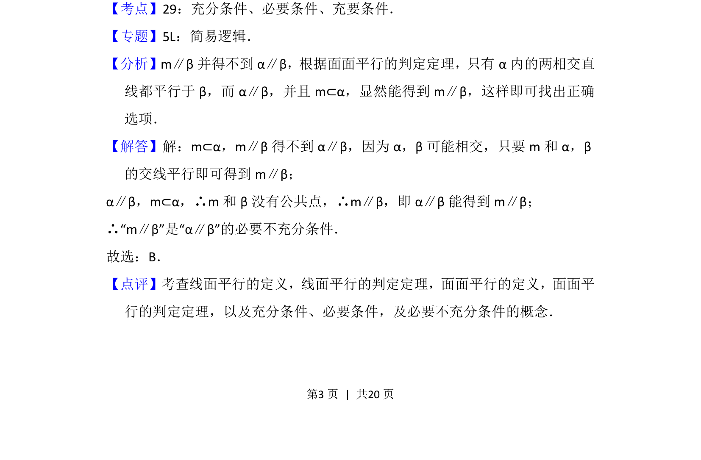

## 题面

## 摘要

考查线面平行与面面平行的关系及充分必要条件的判断

## 关联考点

- [[533-充分必要条件|充分条件与必要条件]]
- [[352-空间直线平面平行|线面平行]]
- [[352-空间直线平面平行|面面平行]]

## 答案与解析

> 📄 原 PDF 第 3 页：`素材/真题/北京/2008-2024·（北京）数学高考真题/2015年高考数学试卷（理）（北京）（解析卷）.pdf`
